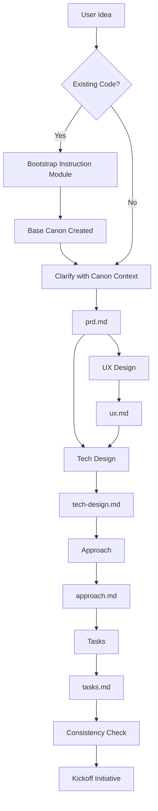

# Emergence: The Cicadas Drafting Phase

> "Everything begins in the dark."

The **Emergence** phase is where vague ideas are refined into structured, actionable specifications *before* a branch is created and code is written.

Depending on project maturity, this phase either builds upon existing **Canon** (brownfield) or starts from scratch (greenfield).

## The Drafts Area

All work in this phase happens in `.cicadas/drafts/{initiative-name}/`. This is a sandbox for drafting. Files here are transient and not yet part of the project's official history.

### Workflow

1. Create folder: `.cicadas/drafts/{initiative-name}/`
2. Draft docs using instruction modules (below) or manually.
3. Builder reviews each artifact before proceeding to the next.
4. Run `python {cicadas-dir}/scripts/cicadas.py kickoff {initiative-name} --intent "description"`:
   - Moves docs to `.cicadas/active/{initiative-name}/`.
   - Registers the initiative in `registry.json`.
   - Creates the initiative branch: `initiative/{name}`.
5. Create feature branches for each partition: `python {cicadas-dir}/scripts/cicadas.py branch {name} --initiative {initiative-name} ...`

## The Workflow

The Emergence phase consists of 5 progressive steps. Each step is handled by a specialized instruction module (or a human wearing that hat). Each instruction module is an inline role — the orchestrator reads the file and follows it in the current context window; no separate agent process is spawned.

| Step | Artifact | Instruction Module | Focus |
|------|----------|----------|-------|
| **0. Bootstrap** | `canon/` suite | `emergence/bootstrap.md` | **Legacy Migration**. Reverse engineer PRD, UX, Tech from existing code. |
| **1. Clarify** | `prd.md` | `emergence/clarify.md` | **What & Why**. Problem, users, success criteria. |
| **2. UX** | `ux.md` | `emergence/ux.md` | **Experience**. Interaction flow, UI states, copy. |
| **3. Tech** | `tech-design.md` | `emergence/tech-design.md` | **Architecture**. Components, data flow, schemas. |
| **4. Approach** | `approach.md` | `emergence/approach.md` | **Strategy & Partitioning**. Implementation plan, sequencing, dependencies, and logical partitions (which become Feature Branches). |
| **5. Tasks** | `tasks.md` | `emergence/tasks.md` | **Execution**. Ordered, testable checklist grouped by partition. |
| **5b. Consistency Check** | _(inline)_ | `emergence/consistency-check.md` | **Cross-phase review**. After Tasks is approved, check all five docs for internal contradictions. Surfaces questions for Builder — no autonomous resolution. |

### Progressive Refinement

- **Input**: Each step consumes the artifacts from the previous steps.
- **Canon-Aware**: On brownfield projects, each instruction module reads existing canon as context. This produces sharper, more targeted specs.
- **Gate**: Human review is required after each step — unless the Builder chose a different pace (see below).
- **Skip**: For simple changes, UX and Tech Design can be skipped or merged into simpler artifacts.

### Requirements intake (Clarify)

At the start of **Clarify**, the agent asks how the Builder wants to provide requirements: **Q&A** (interactive), **Doc** (a requirements document), or **Loom** (video transcript). If Doc: place the file at `.cicadas/drafts/{initiative}/requirements.md` (or an agreed path) and confirm. If Loom: record in Loom, copy the transcript, save to `.cicadas/drafts/{initiative}/loom.md`, then confirm. The agent fills the PRD from the doc or transcript. See [Clarify](./clarify.md) for the exact process.

### Emergence Pace

At the start of **Clarify** (step 0), the agent asks the Builder how often they want to review:

| Pace | Behavior |
|------|----------|
| `section` | Pause after each section within a doc — maximum oversight |
| `doc` | Pause after each complete doc — **default** |
| `all` | Draft all docs without stopping, present together at the end |

The chosen pace is stored in `.cicadas/drafts/{initiative}/emergence-config.json` and read by every subsequent emergence agent. Each agent states the active stop rule at the top of its process before drafting anything.

## Usage

### Standard Start Flow (all entry points)

Whenever the Builder says "start an initiative", "start a tweak", or "start a bug", the agent MUST run the **[Standard Start Flow](./start-flow.md)** first: Name → Create draft folder → (for initiatives: requirements source, pace) → PR preference → then collect requirements or draft the spec. See [start-flow.md](./start-flow.md) for the full sequence and scoping by type.

### Starting an Initiative
1. Run the **Standard Start Flow** (name, draft folder, requirements source, pace, PR preference).
2. Run the **Clarify** instruction module (it embeds the start flow; then draft the PRD).

### The Flow

## Instruction Module References

- [Standard Start Flow](./start-flow.md) — run first for initiative, tweak, or bug
- [Bootstrap](./bootstrap.md)
- [Clarify](./clarify.md)
- [User Experience](./ux.md)
- [Technical Design](./tech-design.md)
- [Approach](./approach.md)
- [Tasks](./tasks.md)
- [Consistency Check](./consistency-check.md)

---

_Copyright 2026 Cicadas Contributors_
_SPDX-License-Identifier: Apache-2.0_
