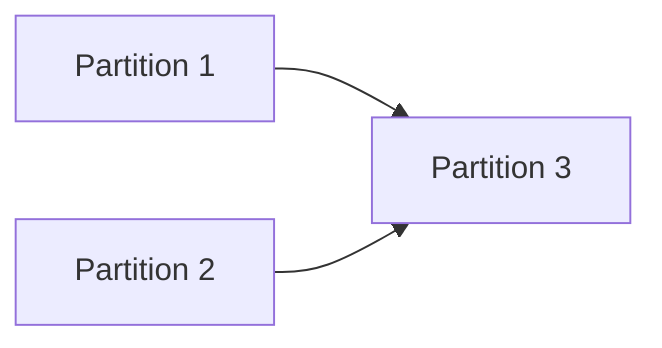

---
summary: "{One tight paragraph summarizing the implementation strategy, partitioning plan, major dependencies, and execution order. Keep it compact enough to seed branch-start context.}"
phase: "approach"
when_to_load:
  - "When starting registered feature branches or reviewing partition scope, sequencing, and dependencies."
  - "When deciding what work can proceed in parallel and what must wait."
depends_on:
  - "prd.md"
  - "ux.md"
  - "tech-design.md"
modules:
  - "{Primary modules or subsystems coordinated by this approach}"
index:
  strategy: "## Strategy"
  partitions: "## Partitions (Feature Branches)"
  sequencing: "## Sequencing"
  migrations_compat: "## Migrations & Compat"
  risks: "## Risks & Mitigations"
  alternatives: "## Alternatives Considered"
next_section: "Strategy"
---

# Approach: {Initiative Name}

## Strategy
{High-level plan: sequential, parallel, phased?}

## Partitions (Feature Branches)

### Partition 1: {Name} → `feat/{branch-name}`
**Modules**: `{module1}`, `{module2}`
**Scope**: {What this partition implements}
**Dependencies**: None / Requires Partition X

#### Artifact Type
{web-ui | rest-api | cli | library | background-service | full-stack}

#### How to Run
- start: `{exact command to start the artifact}` _(omit for library and cli if no persistent process)_
- ready-check: `GET http://localhost:{port}/health returns 200` _(required for any artifact that starts a server)_
- teardown: `Ctrl+C` _(or exact teardown command)_

#### Acceptance Criteria
- [ ] {Falsifiable criterion — e.g. `POST /api/items returns 201 with {id, name}` for APIs; `submitting empty form shows inline error` for UIs; `exit code 0 with expected stdout` for CLIs}
- [ ] {Another specific, independently verifiable criterion}
- [ ] {Criterion that cannot be made machine-verifiable} <!-- NEEDS MANUAL REVIEW -->

#### Implementation Steps
1. {Step 1}
2. {Step 2}

### Partition 2: {Name} → `feat/{branch-name}`
**Modules**: `{module3}`
**Scope**: {What this partition implements}
**Dependencies**: {Dependency description}

#### Artifact Type
{web-ui | rest-api | cli | library | background-service | full-stack}

#### How to Run
- start: `{exact command}`
- ready-check: `{endpoint or condition}`
- teardown: `{command}`

#### Acceptance Criteria
- [ ] {Falsifiable criterion}
- [ ] {Another criterion}

#### Implementation Steps
1. {Step 1}
2. {Step 2}

## Sequencing

{Which partitions can run in parallel? Which must be sequential?}



### Partitions DAG

> This block is machine-readable. It drives automatic worktree creation in `branch.py`.
> - `depends_on: []` → partition runs in parallel (gets its own git worktree)
> - `depends_on: [feat/other]` → partition is sequential (plain branch, waits for dependency)
> - Omit this block entirely to fall back to sequential-only behavior (backward compatible).

```yaml partitions
- name: feat/{branch-name-1}
  modules: [{module1}, {module2}]
  depends_on: []                    # parallel — will get a worktree

- name: feat/{branch-name-2}
  modules: [{module3}]
  depends_on: []                    # also parallel

- name: feat/{branch-name-3}
  modules: [{module4}]
  depends_on: [feat/{branch-name-1}, feat/{branch-name-2}]   # sequential
```

## Migrations & Compat
{How to handle existing data/users without downtime}

## Risks & Mitigations
| Risk | Mitigation |
|------|------------|
| {Risk} | {Mitigation} |

## Alternatives Considered
{Why we didn't do something else}
