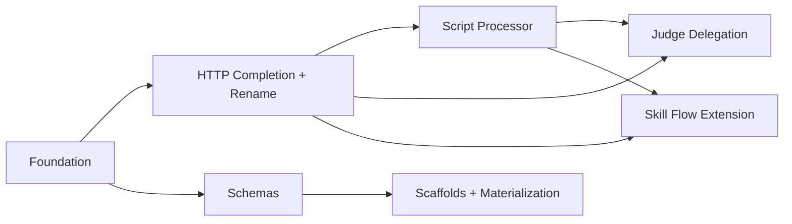

---
summary: "Builds external-runner as a brownfield extension of the existing Step → Processor → OutputRecord pipeline, in eight sequenced partitions: a blocking Foundation (config/runtime models, the in-situ→external rename + alias, classify_external_outcome, the reserved `adapter` seam per ADR-10, and the gavel-skill config-schema.md correction per ADR-9) feeding two parallel-after-Foundation tracks — completing the renamed ExternalHttpProcessor/HTTP path (ADR-1, ADR-8) and building the new ScriptInputProcessor temp-dir path (ADR-4, ADR-5) — followed by judge delegation, documented JSON Schemas, scaffold base classes + materialization (ADR-6, ADR-7), and finally skill-flow extension, with testing layered continuously alongside each slice. Partition boundaries follow the file/module seams ADR-8 and the Implementation Sequence already drew, keeping the rename bundled with the HTTP-completion diff and keeping schema/scaffold work decoupled from the transport implementations they document."
phase: "approach"
when_to_load:
  - "When starting registered feature branches or reviewing partition scope, sequencing, and dependencies."
  - "When deciding what work can proceed in parallel and what must wait."
depends_on:
  - "prd.md"
  - "operator-experience.md"
  - "tech-design.md"
modules:
  - "src/gavel_ai/models/config.py"
  - "src/gavel_ai/models/runtime.py"
  - "src/gavel_ai/core/issue_classifier.py"
  - "src/gavel_ai/core/steps/scenario_processor.py"
  - "src/gavel_ai/core/steps/judge_runner.py"
  - "src/gavel_ai/processors/ (external_http_processor.py, script_processor.py)"
  - "src/gavel_ai/scaffolds/"
  - "docs/specs/schema-external-runner.md"
  - "src/gavel_ai/skill/gavel-skill/"
index:
  strategy: "## Strategy"
  partitions: "## Partitions (Feature Branches)"
  sequencing: "## Sequencing"
  migrations_compat: "## Migrations & Compat"
  risks: "## Risks & Mitigations"
  alternatives: "## Alternatives Considered"
next_section: "Strategy"
---

# Approach: external-runner

## Progress

- [x] Strategy
- [x] Partitions (Feature Branches)
- [x] Sequencing
- [x] Migrations & Compat
- [x] Risks & Mitigations
- [x] Alternatives Considered

## Strategy

This is a **phased, mostly-sequential build with two short parallel windows**, mirroring `tech-design.md`'s Implementation Sequence almost directly — that sequence already encodes the real dependency structure (foundation types → transport completion/build → judge delegation → schemas/scaffolds → skill docs), and re-deriving a different order would only introduce risk without benefit.

The shape:

1. **Foundation first and blocking.** `models/config.py`/`models/runtime.py` changes, the `"in-situ"`→`"external"` rename (with deprecation alias), and the `classify_external_outcome`/`ExternalOutcome`/`Tier`-mapping helper must land before any processor work, because both the HTTP-completion and script-path partitions are built directly against these types (ADR-1, ADR-2, ADR-3). The `gavel-skill` `config-schema.md` correction (ADR-9) rides along in this same partition — it documents exactly the shape this partition stabilizes, and is a blocking precondition for the skill to assist with anything else in this initiative.
2. **Two transport partitions follow, recommended sequential** (HTTP-completion-plus-rename, then script), **but structurally capable of running in parallel** once Foundation merges — they touch disjoint files (`external_http_processor.py` + its `scenario_processor.py` branch vs. `script_processor.py` + its own branch). `tech-design.md` recommends sequencing them (HTTP first, since it reuses an already-implemented processor and "proves out" the classification/routing pattern the script path then borrows) rather than risking two engineers independently reinventing the same idiom. This approach keeps that recommendation as the default ordering, but declares both partitions with `depends_on: [feat/foundation]` only — not on each other — so the Builder can choose to parallelize them if desired (the DAG below reflects the *recommended* sequential ordering; running them in parallel is a valid deviation the partition boundaries already support).
3. **Judge delegation** depends on *both* transports being complete (FR-7 reuses both).
4. **Documented schemas** depends only on Foundation (the Pydantic models that generate them) and can run in parallel with the transport/judge work — it has no code dependency on the processors themselves.
5. **Scaffold base classes + materialization** depend on the schemas (ADR-6: "write against finalized schemas, not evolving ones").
6. **Skill-flow extension** (SKILL.md §2/§6) depends on at least the HTTP path being functional — its guidance must describe real, testable behavior (ADR-9, second half).
7. **Testing is not its own partition** — per `tech-design.md` step 8, unit/integration tests land *alongside* the implementation they cover, inside each partition's Implementation Steps and Acceptance Criteria, not as a trailing slice. The "no regressions on `local`" gate is a continuous constraint checked in every partition that touches `scenario_processor.py`.

## Partitions (Feature Branches)

### Partition 1: Foundation — Models, Rename, and Skill-Doc Correction → `feat/external-runner-foundation`
**Modules**: `src/gavel_ai/models/config.py`, `src/gavel_ai/models/runtime.py`, `src/gavel_ai/core/issue_classifier.py` (or sibling module per ADR-3), `src/gavel_ai/skill/gavel-skill/references/config-schema.md`
**Scope**: Lands every type and primitive the rest of the initiative builds against, in one blocking slice:
- `TestSubject`: `protocol: Literal["http", "script"]` (when `test_subject_type == "external"`), `abort_on_exec_failure: bool = True`, `abort_on_process_error: bool = False`, `adapter: Optional[str] = "gavel"` (new — orthogonal wire-format axis reserved for future front-door adapters, additive/optional, default preserves current behavior exactly; see tech-design ADR-10), protocol-specific `config` sub-shapes (FR-1.2).
- `EvalConfig.test_subject_type`: accept `"external"`; treat `"in-situ"` as a deprecated alias that validates, normalizes internally, and logs a `WARNING`-tier deprecation message naming both values (per the recommended migration path in `tech-design.md` Schema/Migration Notes).
- New `models/runtime.py` types: `ScriptSystemInput`, `ExternalIssue`, `ExternalResponseEnvelope`; additive `JudgedRecord.metadata: Dict[str, Any] = Field(default_factory=dict)`.
- `ExternalOutcome` enum and `classify_external_outcome(outcome, abort_on_exec_failure, abort_on_process_error) -> Tier` pure mapping function (ADR-3), placed beside `classify`/`classify_message`.
- Correct `src/gavel_ai/skill/gavel-skill/references/config-schema.md` to replace the stale `"local" | "remote"` / `"acp" | "open_ai"` documentation with the real `"local" | "external"` / free-text `protocol` shape and the new sub-shapes/flags this partition defines (ADR-9, first half — a blocking precondition, bundled here because the engineer changing the model shape is best positioned to also document it accurately).
**Dependencies**: None — this is the root of the DAG.

#### Artifact Type
library

#### How to Run
- (no persistent process — pure model/library changes; verified via tests and type checks)

#### Acceptance Criteria
- [ ] `TestSubject(test_subject_type="external", protocol="http", config={...})` constructs successfully and `TestSubject(test_subject_type="external", protocol="bogus", ...)` raises a `pydantic.ValidationError` naming `protocol` and the allowed values.
- [ ] `TestSubject` instances default `abort_on_exec_failure` to `True` and `abort_on_process_error` to `False` when unset, and accept explicit overrides of both.
- [ ] `EvalConfig(test_subject_type="in-situ", ...)` validates successfully, normalizes to `"external"` internally (`eval_config.test_subject_type == "external"`), and emits exactly one `WARNING`-level log record naming both `"in-situ"` and `"external"`.
- [ ] `ScriptSystemInput(command=["python", "run.py"], request_payload={...})` constructs with `request_filename="request.json"`/`response_filename="response.json"` defaults, and rejects `command` passed as a bare `str` (type error, not a runtime `.split()`).
- [ ] `ExternalResponseEnvelope.model_validate({"status": "ok", "result": {...}})` and `ExternalResponseEnvelope.model_validate({"status": "error", "issue": {"code": "x", "level": "error", "message": "m"}})` both parse successfully; `model_validate({"status": "bogus"})` raises `ValidationError`.
- [ ] `JudgedRecord(...).metadata == {}` by default, and `JudgedRecord(...).model_dump()` round-trips through JSON without error for an existing `extra="ignore"` consumer fixture.
- [ ] `classify_external_outcome(ExternalOutcome.PROCESS_FAILURE, abort_on_exec_failure=True, abort_on_process_error=False) == Tier.ERROR`; the same call with `abort_on_exec_failure=False` returns `Tier.WARNING`; `classify_external_outcome(ExternalOutcome.PROCESS_SUCCESS_WITH_ISSUE, abort_on_exec_failure=True, abort_on_process_error=True) == Tier.ERROR`; `classify_external_outcome(None, ...)` returns `Tier.OK` — all 8 flag/outcome combinations covered by a parametrized unit test.
- [ ] `TestSubject` accepts an optional `adapter` field defaulting to `"gavel"` (`TestSubject(test_subject_type="external", protocol="http", config={...}).adapter == "gavel"`); omitting it preserves current `external`/`http`|`script` behavior exactly, and `TestSubject(..., adapter="gavel")` is equivalent to omitting it (per ADR-10's reserved seam — no other `adapter` value is implemented or accepted as meaningful in this MVP).
- [ ] `uv run pytest tests/unit/models -m unit` and `uv run pytest tests/unit/core -m unit` (or the relevant module paths for the new tests) exit 0.
- [ ] `uv run mypy src/gavel_ai/models/config.py src/gavel_ai/models/runtime.py src/gavel_ai/core/issue_classifier.py` exits 0 with no new errors.
- [ ] `src/gavel_ai/skill/gavel-skill/references/config-schema.md` no longer contains the strings `"remote"` or `"acp"`/`"open_ai"` as documented `test_subject_type`/`protocol` values, and documents `"local" | "external"` plus the new `protocol`/`abort_on_*` shapes accurately. <!-- NEEDS MANUAL REVIEW -->

#### Implementation Steps
1. Extend `TestSubject` and `EvalConfig` in `models/config.py`: add `protocol`, `abort_on_exec_failure`, `abort_on_process_error`, `adapter: Optional[str] = "gavel"` (additive forward-compat seam, ADR-10 — no behavior depends on its value yet), protocol-specific `config` sub-shape validation, and the `"in-situ"` deprecation-alias normalization with a `WARNING`-tier log emission.
2. Add `ScriptSystemInput`, `ExternalIssue`, `ExternalResponseEnvelope` to `models/runtime.py`; add `metadata` to `JudgedRecord`.
3. Add `ExternalOutcome` and `classify_external_outcome` (ADR-3) beside the existing `classify`/`classify_message` helpers — structured as adapter-parameterizable per ADR-10 (e.g. a strategy/mapping shape keyed by `adapter`, with the Gavel mapping registered as the sole implementation today; this is a structuring convention applied to code already being written, not extra scope).
4. Write unit tests for all of the above (model validation, alias normalization + log assertion, the 8-case classification matrix).
5. Correct `references/config-schema.md` to match the new real shape; spot-check against `SKILL.md` §0/§2 references to ensure no other doc in the skill package contradicts it.
6. Run `uv run pytest -m unit`, `uv run mypy src/`, `uv run ruff check src/` and resolve any findings before merge.

---

### Partition 2: HTTP Path Completion + Rename → `feat/external-http-rename`
**Modules**: `src/gavel_ai/processors/closedbox_processor.py` → `external_http_processor.py` (rename, ADR-8), `src/gavel_ai/processors/__init__.py`, `src/gavel_ai/core/steps/scenario_processor.py` (routing/input-building for `external`/`http`, ADR-1), `src/gavel_ai/core/steps/report_runner.py`, `tests/unit/processors/test_closedbox_processor.py` → `test_external_http_processor.py`, `tests/integration/test_processor_chain_e2e.py`, docstring references in `models/config.py`/`models/runtime.py`, `docs/.private/` references to `closedbox`/`ClosedBox`, `docs/specs/schema-outputs.md` (FR-4.3/ADR-2 — document `trace_id` appearance)
**Scope**: Bundles the mechanical rename (ADR-8: `ClosedBoxInputProcessor`→`ExternalHttpProcessor`, `closedbox_processor.py`→`external_http_processor.py`, and every reference across the ~14 files `grep -rl "closedbox\|closed.box\|closed_box"` surfaces) together with: (a) teaching `ScenarioProcessorStep` to build `RemoteSystemInput` objects for `external`/`http` test subjects and route them through the renamed processor (closing the `inputs == []` stub at `scenario_processor.py:175-214`/`:306`), (b) `trace_id` HTTP-header injection on outbound requests, `metadata["trace_id"]` population on inbound `OutputRecord`s, and documenting that key's appearance in `docs/specs/schema-outputs.md` (ADR-2, FR-4.3 — the doc-update half of ADR-2's "Affects" list that has no other natural home, since this is where `trace_id` first becomes real and populated), and (c) wiring `classify_external_outcome` into the processor's response handling so HTTP outcomes resolve to `ExternalOutcome.PROCESS_FAILURE` / `PROCESS_SUCCESS_WITH_ISSUE` and flow through the existing `_spool_result`/`error_policy.should_halt` machinery untouched (ADR-3). Since the renamed processor is being written here, this is also where the internal transport/wire-format/classification seam from ADR-10 actually lands for the HTTP path — factor "send/receive over the wire" apart from "build the outbound payload" and "parse the inbound response," per the new ADR; this is a structuring convention applied to code already being written, not additional scope. Per ADR-1, the per-variant loop, `_spool_result`, `Executor`, and `_make_output_record` flow are reused unchanged — this is an additive routing branch, not a rewrite. The `local` path's behavior and output shape must remain byte-for-byte unchanged (explicit Quality Gate).
**Dependencies**: `feat/external-runner-foundation` (needs `TestSubject.protocol`/abort flags, `RemoteSystemInput` is pre-existing, `ExternalResponseEnvelope`, `classify_external_outcome`, and the `"external"` value to all exist first).

#### Artifact Type
library

#### How to Run
- (no persistent process — verified via unit tests against a local test-double HTTP server, and integration tests through `ScenarioProcessorStep`)

#### Acceptance Criteria
- [ ] `grep -rl "closedbox\|closed.box\|closed_box\|ClosedBox" src/ tests/ docs/` returns zero matches after the rename (mechanically verifiable).
- [ ] `from gavel_ai.processors.external_http_processor import ExternalHttpProcessor` succeeds; `from gavel_ai.processors.closedbox_processor import ClosedBoxInputProcessor` raises `ModuleNotFoundError`.
- [ ] `tests/unit/processors/test_external_http_processor.py` exists (renamed from `test_closedbox_processor.py`), and `uv run pytest tests/unit/processors/test_external_http_processor.py -m unit` exits 0.
- [ ] An eval config with `test_subject_type: "external"`, `protocol: "http"` produces a non-empty `inputs` list of `RemoteSystemInput` objects from `ScenarioProcessorStep` (where today it produces `[]`), one per scenario/variant combination — verified by an integration test asserting `len(inputs) == expected_count`.
- [ ] An eval run against a local test-double HTTP server returns 2xx with an `ExternalResponseEnvelope(status="ok", ...)` body and produces a populated `results_raw.jsonl` record whose `metadata["trace_id"]` matches the run's `trace_id` and whose `metadata` contains `timing_ms`.
- [ ] An eval run against a test-double server returning a 503 produces an `OutputRecord`/log entry classified as `process_failure`, and (with default `abort_on_exec_failure=True`) the run halts via `RunPolicyError` — not a generic exception.
- [ ] An eval run against a test-double server returning `200` with `ExternalResponseEnvelope(status="ok", issue={"code": "x", "level": "warning", ...})` produces a `WARNING`-tier log entry, continues the run (default `abort_on_process_error=False`), and the resulting record carries the issue in `metadata`/`error`.
- [ ] The outbound HTTP request carries a `trace_id` header (configurable name, documented default) equal to `get_current_run_id()`'s trace value for the run.
- [ ] `docs/specs/schema-outputs.md` documents `metadata["trace_id"]` as present (and resolvable to a `telemetry.jsonl` span for the same `run_id`) on externally-executed `OutputRecord`/`JudgedRecord` entries, and explicitly absent on in-process records (FR-4.3, ADR-2).
- [ ] An existing `local`/`PromptInputProcessor` integration test (`tests/integration/test_oneshot_pipeline_e2e.py` or equivalent) passes unchanged, demonstrating zero regression to the `local` path.
- [ ] `uv run pytest tests/integration/test_processor_chain_e2e.py -m integration` and `uv run pytest -m unit` both exit 0.
- [ ] `uv run mypy src/gavel_ai/processors/external_http_processor.py src/gavel_ai/core/steps/scenario_processor.py` exits 0 with no new errors.

#### Implementation Steps
1. Rename the file and class (`closedbox_processor.py`→`external_http_processor.py`, `ClosedBoxInputProcessor`→`ExternalHttpProcessor`); update every import/instantiation/docstring reference identified by the grep audit, including `processors/__init__.py`, `report_runner.py`, and `docs/.private/` notes.
2. Rename and update the test module (`test_closedbox_processor.py`→`test_external_http_processor.py`).
3. Extend `ScenarioProcessorStep`'s routing (`scenario_processor.py:247-249`) and input-building block (`:175-214`/`:306`) with a parallel branch: `test_subject_type == "external" and protocol == "http"` → build one `RemoteSystemInput` per scenario/variant from `system_id`/`protocol`/`config`, pass to `ExternalHttpProcessor`.
4. Add `trace_id` header injection to the outbound request in `ExternalHttpProcessor` (configurable header name with documented default), populate `metadata["trace_id"]` in `_make_output_record` for externally-executed records, and update `docs/specs/schema-outputs.md` to document that key's appearance (present-when-externally-executed, absent on in-process records) per FR-4.3/ADR-2.
5. Wire `classify_external_outcome` into the processor's response-handling path: derive `ExternalOutcome` from HTTP status / `ExternalResponseEnvelope.status`/`issue`, call the mapping function with the `TestSubject`'s abort flags, and surface the resulting tier through `ProcessorResult.error`/`metadata["external_outcome"]` so `_spool_result`'s existing `classify_message`/`should_halt` path handles it without re-deriving the tier.
6. Write/extend unit tests (local test-double HTTP server, both outcome tiers, both flag settings) and integration tests (`ScenarioProcessorStep` end-to-end with the renamed processor).
7. Run the full `local`-path regression suite and confirm zero behavior change.

---

### Partition 3: Script Execution Path → `feat/external-script-processor`
**Modules**: `src/gavel_ai/processors/script_processor.py` (new), `src/gavel_ai/processors/__init__.py`, `src/gavel_ai/core/steps/scenario_processor.py` (routing/input-building for `external`/`script`)
**Scope**: New `ScriptInputProcessor` conforming to the existing `Processor`/`InputProcessor` interface (FR-3.1). For each invocation: opens a per-invocation `tempfile.TemporaryDirectory`, writes a JSON request document (`ExternalTaskRequest`-shaped payload including scenario fields, custom config, rendered prompt content, and `trace_id`), launches the configured command via `asyncio.create_subprocess_exec` (argument-list form, no shell), awaits completion under `async_config.task_timeout_seconds` (terminate SIGTERM→SIGKILL on timeout per ADR-4), reads and validates a JSON response document against `ExternalResponseEnvelope`, classifies the outcome via `classify_external_outcome`, and returns a `ProcessorResult`. As a net-new processor, it is written from the start with the transport/wire-format/classification seam from ADR-10 — request-building and response-parsing factored apart from the temp-dir/subprocess transport mechanics — so a future sibling adapter can slot in beside it without a rewrite. All request/response I/O is confined to the temp dir using the same `resolved.startswith(...)` path-confinement pattern `judge_runner.py::_load_markdown_judge_config` already implements (ADR-5) — only filenames, never directories, are configurable. The temp directory is guaranteed removed on every exit path via `async with tempfile.TemporaryDirectory()`.
**Dependencies**: `feat/external-runner-foundation` (needs `ScriptSystemInput`, `ExternalResponseEnvelope`, `classify_external_outcome`, `TestSubject.protocol == "script"` config shapes). Recommended to follow `feat/external-http-rename` so the routing/classification idiom is proven first (per `tech-design.md` step 3 rationale), but does not structurally require it — the two partitions touch disjoint files.

#### Artifact Type
library

#### How to Run
- (no persistent process — verified via unit tests using real `tmp_path` directories and a real trivial checked-in fixture script subprocess, no `MagicMock` of filesystem/process, per [[feedback_real_tests]])

#### Acceptance Criteria
- [ ] `from gavel_ai.processors.script_processor import ScriptInputProcessor` succeeds and `ScriptInputProcessor` is importable from `gavel_ai.processors`.
- [ ] A round-trip test using a real checked-in fixture script (e.g. an `echo`-style script that reads `request.json` and writes a valid `response.json`) produces a `ProcessorResult` with populated `result`, `timing_ms`, and `metadata`, and the temp directory no longer exists on disk after `process()` returns.
- [ ] The request document written to the temp dir is valid JSON matching the documented script task-request shape (scenario fields, custom config, rendered prompt content, `trace_id` present and equal to the run's trace id).
- [ ] A fixture script that exits non-zero produces a `ProcessorResult` classified as `ExternalOutcome.PROCESS_FAILURE`, with `stderr` captured (bounded length) in `metadata["stderr"]`, and (default `abort_on_exec_failure=True`) the run halts via `RunPolicyError`.
- [ ] A fixture script that exceeds the configured `task_timeout_seconds` is terminated (process no longer running after the call returns), classified as `PROCESS_FAILURE`, and the temp directory is still cleaned up.
- [ ] A fixture script that exits 0 but writes no `response.json` (or writes invalid JSON) is classified as `PROCESS_FAILURE` with a message naming the missing/invalid path — not a generic deserialization error.
- [ ] A fixture script that writes `{"status": "ok", "issue": {"code": "low_confidence", "level": "warning", ...}}` produces a `WARNING`-tier classification, continues the run (default `abort_on_process_error=False`), and the issue lands in the resulting record's `metadata`/`error`.
- [ ] A `TestSubject.config` for `protocol: "script"` that attempts to set a response path containing `../` is rejected by the confinement check with a `ProcessorError` naming the offending path and the expected boundary (mirroring `_load_markdown_judge_config`'s "X resolves outside Y - Path traversal not allowed" message style).
- [ ] An end-to-end `ScenarioProcessorStep` integration test for `test_subject_type: "external"`/`protocol: "script"` produces `results_raw.jsonl` records in the same schema shape (`timing_ms`, `error`, `metadata`, `timestamp`) as `local`/in-process records.
- [ ] Concurrent invocations (`async_config.num_workers > 1`) against the fixture script never collide on temp-directory paths (parametrized test with `num_workers >= 2`).
- [ ] `uv run pytest tests/unit/processors/test_script_processor.py -m unit` and the new integration test (e.g. `uv run pytest tests/integration/test_external_runner_e2e.py -m integration -k script`) both exit 0.
- [ ] `uv run mypy src/gavel_ai/processors/script_processor.py` exits 0 with no new errors.

#### Implementation Steps
1. Add `ScriptInputProcessor(InputProcessor)` skeleton conforming to the `Processor`/`ProcessorConfig` constructor pattern (`config: ProcessorConfig, **kwargs`), with `self.tracer = get_tracer(__name__)` matching `ExternalHttpProcessor`'s convention.
2. Implement the per-invocation lifecycle: `async with tempfile.TemporaryDirectory()`, write request document, `asyncio.create_subprocess_exec(*command, cwd=tmpdir)`, `asyncio.wait_for(..., timeout=...)` with SIGTERM→SIGKILL escalation on timeout, capture stdout/stderr (bounded).
3. Implement response-document read + path-confinement check (reusing/adapting `_load_markdown_judge_config`'s pattern) and `ExternalResponseEnvelope` validation.
4. Wire `classify_external_outcome` into the outcome-handling path identically to Partition 2's integration (derive `ExternalOutcome` from exit code / document presence / envelope `status`/`issue`).
5. Extend `ScenarioProcessorStep`'s routing/input-building with the `external`/`script` branch: build one `ScriptSystemInput` per scenario/variant.
6. Add a checked-in fixture script (or scripts) under `tests/fixtures/` covering: success, non-zero exit, timeout, missing/invalid response document, and warning-issue cases.
7. Write unit tests (real `tmp_path`, real fixture-script subprocess) and the integration round-trip test.

---

### Partition 4: External Judge Delegation → `feat/external-judge-delegation`
**Modules**: `src/gavel_ai/core/steps/judge_runner.py`, `src/gavel_ai/models/config.py` (judge config shape extension)
**Scope**: Extends `JudgeRunnerStep`/`JudgeExecutor` so judges can be configured to delegate scoring to an external system via the same two transports (`http`/`script`), using a config shape consistent with `TestSubject`'s `protocol`/`config`/`system_id` pattern and reusing the *same* `abort_on_exec_failure`/`abort_on_process_error` flags (FR-7.1). Routes through the now-functional `ExternalHttpProcessor`/`ScriptInputProcessor` rather than duplicating transport logic, and produces `JudgedRecord`s (`judge_id`, `score`, `reasoning`, `error`, `timestamp`, and the new `metadata["trace_id"]`) indistinguishable in shape from in-process LLM-judge output, conforming to the documented judge request/response schemas.
**Dependencies**: `feat/external-http-rename` AND `feat/external-script-processor` (FR-7 reuses both transports — this partition cannot be meaningfully implemented or tested until both are functional).

#### Artifact Type
library

#### How to Run
- (no persistent process — verified via unit and integration tests against the same test-double server / fixture script used in Partitions 2 and 3)

#### Acceptance Criteria
- [ ] A judge configured with `protocol: "http"` and pointed at a test-double server produces a `JudgedRecord` with populated `judge_id`, `score`, `reasoning`, and `metadata["trace_id"]` equal to the run's trace id.
- [ ] A judge configured with `protocol: "script"` and pointed at a fixture judge-script produces a `JudgedRecord` of the identical shape, via the same temp-dir request/response handoff Partition 3 implements.
- [ ] A judge whose external call returns a process-failure outcome is classified via `classify_external_outcome` and respects `abort_on_exec_failure` identically to task execution (parametrized test mirroring Partition 2/3's tier-classification cases).
- [ ] A judge whose external call returns a process-success-with-issue outcome populates `JudgedRecord.error`/`metadata` with the issue and respects `abort_on_process_error`.
- [ ] `JudgedRecord` entries produced via external delegation flow into `results_judged.jsonl` through the existing storage path with no schema-shape difference from in-process judge output (assert via a diffed-fields test against an in-process `JudgedRecord` fixture).
- [ ] `uv run pytest tests/unit/core/test_judge_runner.py -m unit` and an external-judge integration test (e.g. `uv run pytest tests/integration/test_external_runner_e2e.py -m integration -k judge`) both exit 0.
- [ ] `uv run mypy src/gavel_ai/core/steps/judge_runner.py` exits 0 with no new errors.

#### Implementation Steps
1. Extend the judge config model (in `models/config.py`) to accept `protocol`/`config`/`system_id`/abort-flag fields consistent with `TestSubject`'s shape.
2. Extend `JudgeRunnerStep`/`JudgeExecutor` to route external-judge configs through `ExternalHttpProcessor`/`ScriptInputProcessor` (constructing `RemoteSystemInput`/`ScriptSystemInput` from judge-specific request content — rendered judge criteria/prompt instead of task prompts).
3. Map processor results into `JudgedRecord`s, populating `metadata["trace_id"]` and routing classification through `classify_external_outcome`/existing `IssueClassifier`/`ErrorPolicy`.
4. Write unit tests (config validation, both transports, both outcome tiers) and an integration round-trip test producing real `results_judged.jsonl` records.

---

### Partition 5: Documented Schemas → `feat/external-runner-schemas`
**Modules**: `docs/specs/schema-external-runner.md` (new), a schema-generation script (e.g. `scripts/generate_external_schemas.py` or similar, co-located per existing doc-generation conventions)
**Scope**: Publishes the eight documented JSON Schemas (HTTP task request/response, HTTP judge request/response, script task request/response document, script judge request/response document) using `model_json_schema()` on the Pydantic models defined in Partition 1 (`ExternalTaskRequest`/`ExternalJudgeRequest`/`ExternalResponseEnvelope` and friends — the exact request models are finalized here as part of authoring this doc, since the PRD only specifies their *minimum content* (FR-6.2/FR-6.3), not their final names/shapes). Published under `docs/specs/` alongside `schema-configs.md`/`schema-outputs.md` so Builders find all schema references in one place (FR-6.1). Generation runs at doc/build time, not eval-run time — zero runtime cost.
**Dependencies**: `feat/external-runner-foundation` (needs the foundation Pydantic models to generate schemas from). Can run in parallel with Partitions 2, 3, and 4 — no code dependency on the processors themselves, only on the models.

#### Artifact Type
library

#### How to Run
- `uv run python scripts/generate_external_schemas.py` (or the equivalent path chosen for the generation script) <!-- NEEDS MANUAL REVIEW: exact script path/invocation TBD at implementation time per ADR's "schema generation cost is build/doc-time only" note -->

#### Acceptance Criteria
- [ ] `docs/specs/schema-external-runner.md` exists and documents exactly eight payload shapes: HTTP task request, HTTP task response, HTTP judge request, HTTP judge response, script task request, script task response, script judge request, script judge response.
- [ ] Each documented request schema includes, at minimum, fields for: scenario data, custom config (from `eval_config`), required prompt/judge content, and `trace_id` (FR-6.2) — verified by checking the generated JSON Schema's `properties` keys against this list.
- [ ] Each documented response schema includes, at minimum: `status`, `result`, `metadata`, and an `issue` envelope distinguishing the two error tiers (FR-6.3) — verified against `ExternalResponseEnvelope.model_json_schema()`'s `properties`.
- [ ] Running the schema-generation script produces valid JSON Schema documents (`jsonschema.Draft202012Validator.check_schema(schema)` does not raise) for all eight shapes.
- [ ] `docs/specs/schema-external-runner.md` is cross-linked from (or alongside) `docs/specs/schema-configs.md`/`schema-outputs.md` per the existing doc-organization convention.
- [ ] A round-trip check: a real Gavel-generated request payload (from a Partition 2/3 integration-test fixture) validates successfully against its corresponding published schema. <!-- NEEDS MANUAL REVIEW: depends on fixtures existing from Partitions 2-4; verify cross-partition fixture reuse path at implementation time -->

#### Implementation Steps
1. Finalize the `ExternalTaskRequest`/`ExternalJudgeRequest` Pydantic models (the PRD specifies minimum content, not final shape) alongside the already-foundation-landed `ExternalResponseEnvelope`/`ExternalIssue`.
2. Write a generation script that calls `model_json_schema()` on each of the eight request/response models and writes the results to static JSON files (or embeds them in the markdown doc, per the chosen doc convention).
3. Author `docs/specs/schema-external-runner.md`: prose description of each of the eight shapes, links to/embeds of the generated schemas, and a documented limit/truncation note for unbounded payload fields (per the Security & Performance section's "bound and truncate" guidance).
4. Cross-link from `schema-configs.md`/`schema-outputs.md`.
5. Write a test asserting the generation script produces valid JSON Schema for all eight shapes.

---

### Partition 6: Scaffold Base Classes & Materialization → `feat/external-runner-scaffolds`
**Modules**: `src/gavel_ai/scaffolds/` (new package: `__init__.py`, `base.py`, `remote.py`, `script.py`, `_materialize.py`, `templates/`), `pyproject.toml` (`[tool.setuptools.package-data]` extension to cover `scaffolds/templates/*`), the eval-creation/`gavel init` code path (one new conditional call)
**Scope**: Ships `RemoteSystemUnderTest` and `ScriptSystemUnderTest`, unified by a shared `_BaseSystemUnderTest` mixin (ADR-6) providing request parsing/validation against the documented schemas, `trace_id`-correlated log/span emission (mirroring, not importing, `telemetry/spans.py` conventions — the scaffold has no `run_id`/eval directory), and `status`/`issue` envelope assembly — so subclasses implement exactly one method (`handle(request) -> result`, FR-8.3). Also ships `_materialize.py`, which copies the protocol-appropriate scaffold template into `{eval_dir}/scripts/{name}_scaffold.py` with a header comment recording the source module path and a content-hash/version marker (ADR-7 drift-detection mitigation), invoked from the existing eval-creation/scaffolding path only when `test_subject_type == "external"`.
**Dependencies**: `feat/external-runner-schemas` (ADR-6: "the scaffolds *are* the documented schemas made concrete on the other side of the wire" — must be written against finalized schemas, not evolving ones).

#### Artifact Type
library

#### How to Run
- (no persistent process for the base classes themselves — verified via round-trip tests driving a minimal subclass through `_parse_and_validate` → `handle` → `_assemble_response`; materialization verified by running the eval-creation CLI path, e.g. `uv run gavel init` against a temp eval directory)

#### Acceptance Criteria
- [ ] `from gavel_ai.scaffolds import RemoteSystemUnderTest, ScriptSystemUnderTest` succeeds, and importing either does not import any Gavel pipeline/runtime module (`gavel_ai.core.*`) — verified by inspecting `sys.modules` deltas in a test, confirming the documented separation ("must not pull in Gavel's runtime/pipeline dependencies").
- [ ] A minimal subclass overriding only `handle(request) -> result` round-trips a real Gavel-generated request fixture (from Partition 2/3's fixtures) into a schema-valid `ExternalResponseEnvelope` response — for both `RemoteSystemUnderTest` and `ScriptSystemUnderTest`.
- [ ] The base class rejects a malformed request with a clear, schema-referencing error naming the missing/mismatched field and the schema doc path — not a generic deserialization stack trace (verified by asserting the exception message contains the field name and `schema-external-runner.md`).
- [ ] When `handle` raises, the assembled response has `status: "error"`; when `handle` returns a result carrying an issue, the assembled response has `status: "ok"` with `issue` populated — both schema-valid per `ExternalResponseEnvelope`.
- [ ] The base class emits a structured log line and (when an OTEL endpoint is configured) a span carrying the inbound `trace_id` as an attribute, for each `handle` invocation.
- [ ] `_materialize(eval_dir, protocol="http"|"script")` copies the correct template to `{eval_dir}/scripts/{name}_scaffold.py`, the file contains a header comment with the source module path and a version/hash marker, and the file is syntactically valid Python (`ast.parse` does not raise).
- [ ] Creating a new eval configured with `test_subject_type: "external"` (e.g. via `uv run gavel init` or the equivalent eval-scaffolding command) results in a scaffold file present in that eval's `scripts/` directory; creating a `local`-only eval does not produce one.
- [ ] `pyproject.toml`'s `[tool.setuptools.package-data]` includes `scaffolds/templates/*`, and `python -c "import gavel_ai.scaffolds; print(gavel_ai.scaffolds.__file__)"` resolves after an installed-package check (e.g. `pip show -f gavel-ai | grep scaffolds/templates`). <!-- NEEDS MANUAL REVIEW: exact packaging verification command depends on build/install method used in CI -->
- [ ] `uv run pytest tests/unit/scaffolds -m unit` and an integration round-trip test both exit 0.
- [ ] `uv run mypy src/gavel_ai/scaffolds/` exits 0 with no new errors.

#### Implementation Steps
1. Implement `_BaseSystemUnderTest` mixin in `scaffolds/base.py`: `_parse_and_validate`, `_emit_span`, `_assemble_response`, all built against the Partition 5 schemas/models.
2. Implement `RemoteSystemUnderTest` (HTTP server entrypoint glue) and `ScriptSystemUnderTest` (script `main()` glue reading/writing temp-dir documents) in `remote.py`/`script.py`, each adding only transport glue atop the mixin.
3. Author scaffold template files (one per protocol) under `scaffolds/templates/`, each a thin subclass stub with inline comments pointing at the documented schema and the canonical base class.
4. Implement `_materialize.py`: copy-with-version-marker function, invoked conditionally from the eval-creation path.
5. Extend `pyproject.toml` package-data to include `scaffolds/templates/*`.
6. Write round-trip tests (minimal subclass through the full mixin pipeline, both transports) and a materialization test (file copied, header present, syntactically valid).

---

### Partition 7: Skill Flow Extension → `feat/external-runner-skill-flows`
**Modules**: `src/gavel_ai/skill/gavel-skill/SKILL.md`, `src/gavel_ai/skill/gavel-skill/references/cli-reference.md`
**Scope**: Extends `SKILL.md`'s setup flow (§2) and debugging guidance (§6) to walk a Builder conversationally through `external`/`http`|`script` configuration (endpoint/auth or command/args/timeout, abort-flag selection in operator vocabulary) and two-tier-failure interpretation (naming the tier, relaying — not paraphrasing away — the cause and `trace_id`), per the flows and copy guidelines in `operator-experience.md`. Updates `references/cli-reference.md` only if `external`-specific CLI behavior needs documenting (likely minimal, since execution still goes through `gavel oneshot run`). This is the second half of ADR-9 — sequenced last among build-adjacent partitions because its guidance must describe real, working behavior, not a moving target.
**Dependencies**: `feat/external-http-rename` AND `feat/external-script-processor` (the skill must be able to describe both transports' real, functional behavior — partial coverage would mean shipping guidance for a feature that doesn't fully exist yet).

#### Artifact Type
library
<!-- the skill package is documentation/prompt-config consumed by Claude Code, not a running service; "library" is the closest fit among the defined artifact types — flagging for Builder confirmation -->
<!-- NEEDS MANUAL REVIEW: confirm "library" is the intended artifact-type classification for a Claude Code skill doc-extension partition -->

#### How to Run
- (no persistent process — verified by inspecting the rendered `SKILL.md`/reference docs for required content, and via the skill's own self-maintenance scripts if applicable, e.g. `uv run python src/gavel_ai/skill/gavel-skill/scripts/update_cli_reference.py --check`)

#### Acceptance Criteria
- [ ] `SKILL.md` §2 (setup flow) contains a documented path for `test_subject_type: "external"` covering both `protocol: "http"` and `protocol: "script"`, including how the abort flags are explained in operator vocabulary (e.g. "should the run stop if the service is unreachable?").
- [ ] `SKILL.md` §6 (debug flow) documents how to distinguish and relay "process failure" vs. "process success with internal error/warning" — naming the tier, the cause, and `trace_id` — matching the phrasing patterns in `operator-experience.md`'s Copy and Message Guidelines (e.g. does not soften "process failure" into a vaguer phrase).
- [ ] Neither `SKILL.md` nor `references/cli-reference.md` contains the stale strings `"remote"` or `"acp"`/`"open_ai"` as documented `test_subject_type`/`protocol` values (consistency check against Partition 1's `config-schema.md` correction).
- [ ] `references/cli-reference.md` documents any `external`-specific CLI output/flags introduced by this initiative, or explicitly notes none were needed. <!-- NEEDS MANUAL REVIEW: "explicitly notes none were needed" requires a human judgment call on completeness -->
- [ ] A walkthrough transcript or fixture conversation (if the skill has a test-conversation convention) demonstrates the skill correctly explaining at least one process-failure and one process-success-with-issue scenario using the tier vocabulary verbatim. <!-- NEEDS MANUAL REVIEW: requires manual/agent-mediated verification of conversational quality, not purely mechanical -->

#### Implementation Steps
1. Read `operator-experience.md`'s Operator Flows (Flow 1, Flow 2) and Copy and Message Guidelines in full; extract the exact phrasing patterns the skill must relay.
2. Extend `SKILL.md` §2 with the `external`/`http`|`script` setup conversation flow (questions to ask, config fields to write, abort-flag explanation in plain language).
3. Extend `SKILL.md` §6 with the two-tier-failure debugging flow (how to read the Rich panel/`run.log`, name the tier, point at `trace_id`).
4. Update `references/cli-reference.md` if any `external`-specific CLI behavior was introduced by Partitions 2-4; otherwise note explicitly that none was needed.
5. Run any existing skill self-consistency/update scripts (e.g. `update_cli_reference.py`) and confirm no drift warnings.

---

## Sequencing

Foundation is the sole root and hard gate. After it merges, the two transport partitions (HTTP-completion-plus-rename and script) are **structurally parallel** (disjoint files) but **recommended sequential** — this approach declares them with the recommended ordering in the DAG below (script depends on the HTTP partition merging) so a solo Builder gets the lower-risk path by default; a team that wants to parallelize them can safely override `depends_on` for the script partition to `[feat/external-runner-foundation]` only, since no file-level conflict exists. Schemas can start as soon as Foundation merges and proceeds independently of the transport work. Judge delegation needs both transports done. Scaffolds need the schemas finalized. Skill-flow extension needs both transports working so its guidance is accurate.



### Partitions DAG

> This block is machine-readable. It drives automatic worktree creation in `branch.py`.
> - `depends_on: []` → partition runs in parallel (gets its own git worktree)
> - `depends_on: [feat/other]` → partition is sequential (plain branch, waits for dependency)
> - Omit this block entirely to fall back to sequential-only behavior (backward compatible).

```yaml partitions
- name: feat/external-runner-foundation
  modules: [models/config.py, models/runtime.py, core/issue_classifier.py, skill/gavel-skill/references/config-schema.md]
  depends_on: []                    # parallel — root of the DAG, gets a worktree

- name: feat/external-http-rename
  modules: [processors/external_http_processor.py, core/steps/scenario_processor.py, core/steps/report_runner.py]
  depends_on: [feat/external-runner-foundation]

- name: feat/external-runner-schemas
  modules: [docs/specs/schema-external-runner.md]
  depends_on: [feat/external-runner-foundation]

- name: feat/external-script-processor
  modules: [processors/script_processor.py, core/steps/scenario_processor.py]
  depends_on: [feat/external-http-rename]

- name: feat/external-judge-delegation
  modules: [core/steps/judge_runner.py, models/config.py]
  depends_on: [feat/external-http-rename, feat/external-script-processor]

- name: feat/external-runner-scaffolds
  modules: [scaffolds/]
  depends_on: [feat/external-runner-schemas]

- name: feat/external-runner-skill-flows
  modules: [skill/gavel-skill/SKILL.md, skill/gavel-skill/references/cli-reference.md]
  depends_on: [feat/external-http-rename, feat/external-script-processor]
```

## Migrations & Compat

- **`test_subject_type` rename (`"in-situ"` → `"external"`)**: handled entirely within Partition 1 via a deprecation-alias normalization (per `tech-design.md`'s recommended migration path, resolving the `prd.md` Open Question). Existing configs using `"in-situ"` continue to validate, are normalized internally to `"external"`, and emit a `WARNING`-tier log naming both values and the doc section to update. No persisted-artifact migration is needed — `test_subject_type` lives only in Builder-owned, version-controlled `eval_config.json`. Rollback is trivial: removing the alias-handling code simply stops recognizing `"in-situ"`.
- **`ClosedBoxInputProcessor` → `ExternalHttpProcessor` rename (ADR-8)**: a hard, mechanical rename bundled into Partition 2 — no alias is provided for the *class/module* name (unlike the config-value rename) because it is an internal implementation detail, not a Builder-facing config surface; any external code importing `ClosedBoxInputProcessor` directly (unlikely, but possible for advanced Builders) breaks with a clear `ImportError`/`ModuleNotFoundError`. The grep-audit acceptance criterion in Partition 2 ensures no reference is missed.
- **`OutputRecord`/`JudgedRecord` shape changes**: purely additive (`metadata["trace_id"]` key usage on `OutputRecord`'s existing `Dict` field; new `metadata: Dict[str, Any] = Field(default_factory=dict)` on `JudgedRecord`). Both are `extra="ignore"` Pydantic models — existing reporters, schema validators, and Jinja2 templates that don't reference the new key are unaffected, with zero schema-break risk (ADR-2).
- **`local`/in-process path**: zero interface or behavior change — `PromptInputProcessor` and its routing branch are untouched throughout (ADR-1). Every transport partition's acceptance criteria includes an explicit "existing `local` test passes unchanged" check, making this a continuously-verified gate rather than a one-time check.
- **Builders currently configured with `"in-situ"`/`"http"`** (today silently getting zero-record runs due to the stub) will, after Partition 2 merges, start getting real results — a behavior change that fixes a latent bug rather than breaking working behavior, and one the deprecation-alias path keeps validating throughout the transition.
- **`gavel-skill` reference docs**: corrected in Partition 1 (blocking) because they are *already* wrong relative to the current `local`/`in-situ` shape — this is fix-forward work independent of the rest of the initiative, not new-feature documentation that could slip.

## Risks & Mitigations

| Risk | Mitigation |
|------|------------|
| Foundation partition becomes an unintentional bottleneck — every other partition blocks on it, and any rework there cascades | Keep Foundation's scope strictly to types/primitives/the rename/the doc correction (no processor logic); its acceptance criteria are narrow and mechanically checkable, minimizing rework risk; land it first and treat any post-merge Foundation change as a signal to pause downstream work |
| HTTP and script partitions both touch `scenario_processor.py`, risking merge conflicts even though they add disjoint branches to the same `if`/`elif` routing block | Declared sequential in the DAG (script depends on HTTP) specifically to avoid this; if a Builder chooses to parallelize them anyway, flag this file as a known collision point requiring careful rebase/merge ordering |
| Judge delegation (Partition 4) starts before both transports are fully stable, producing rework | DAG declares `depends_on: [feat/external-http-rename, feat/external-script-processor]` — both must merge first; this is the only triple-dependency partition by design |
| Scaffold base classes (Partition 6) get built against schemas that later change, causing drift between scaffold and schema | DAG declares scaffolds depend on schemas merging first (ADR-6 rationale: "write against finalized schemas, not evolving ones"); the materialization version-marker (ADR-7) additionally makes any *future* drift detectable |
| Skill-flow extension (Partition 7) ships guidance describing behavior that doesn't fully exist yet, misleading Builders | DAG declares it depends on both transport partitions merging — its acceptance criteria require describing *real, functional* `http` and `script` paths, not aspirational ones |
| Completing the stubbed HTTP path surfaces deeper variant/model-semantics gaps (flagged in `prd.md` Risk Mitigation and `tech-design.md` Known Implementation Risks) | Carried forward unchanged into Partition 2's Implementation Steps as a short investigation spike at the start of that partition's work; if gaps are large, narrow that partition's slice and document follow-ups rather than expanding scope mid-stream |
| Subprocess timeout/kill semantics (SIGTERM/SIGKILL, process-group handling) behave inconsistently across platforms, undermining Partition 3's classification correctness | Carried forward as a short spike at the start of Partition 3's Implementation Steps, per `tech-design.md`'s Known Implementation Risks |
| The mechanical `ClosedBoxInputProcessor`→`ExternalHttpProcessor` rename misses a reference, silently breaking the HTTP path or its tests | Partition 2's first acceptance criterion is a zero-result grep audit (`grep -rl "closedbox\|closed.box\|closed_box\|ClosedBox" ...`), making the completeness of the rename mechanically verifiable rather than reviewer-judgment-dependent |
| Two-tier classification / trace correlation logic gets hardwired to the Gavel envelope shape, blocking future adapters | Write `classify_external_outcome` and trace correlation as adapter-parameterizable from the start, per tech-design ADR-10, even though only the Gavel mapping ships now — Partition 1 lands the parameterizable shape, Partitions 2/3 wire the renamed/new processors against it rather than against a hardcoded envelope assumption |

## Alternatives Considered

- **Single monolithic partition for "everything external-runner."** Rejected: the tech-design's own Implementation Sequence already identifies clean file/module seams (foundation types vs. HTTP processor vs. script processor vs. judge vs. schemas vs. scaffolds vs. skill docs) with explicit dependency reasoning; collapsing them into one branch would force one engineer (or one agent context) to hold the entire diff at once, lose the ability to land the highest-value slice (HTTP completion) early and independently, and make review far harder. Partitioning along the seams the tech-design already drew is the lowest-risk option, not an arbitrary choice.
- **Splitting the rename (ADR-8) into its own partition, separate from HTTP-path completion.** Rejected, per ADR-8's own rationale: the rename and the HTTP-completion both touch `external_http_processor.py`/`scenario_processor.py`/the test module — bundling them means one engineer owns both diffs together (avoiding two changes colliding on the same lines), and "rides along" on a diff that's touching the file anyway rather than becoming a separate, harder-to-justify-in-isolation change later.
- **Running HTTP-completion and script-processor partitions fully in parallel as the default.** Considered, since they are file-disjoint and the template's DAG mechanism would happily grant both worktrees. Rejected as the *default* recommendation (though structurally still possible — see Strategy) because `tech-design.md` explicitly recommends sequencing them so the script path can "borrow proven patterns rather than two engineers independently discovering the same `classify_external_outcome`/routing idioms" — a real coordination-cost argument that outweighs the modest parallelism gain for what is, per the PRD, a "Medium" complexity initiative built on existing abstractions (not a large initiative where parallel throughput dominates).
- **Treating "Testing" as its own partition/branch.** Rejected: `tech-design.md` step 8 explicitly calls for tests to land "alongside their implementations" and for the "no regressions on `local`" gate to "run continuously from step 1 onward." A separate testing partition would either duplicate the per-partition Acceptance Criteria (this approach's chosen mechanism for embedding test obligations) or create an artificial "implementation done, now test it" handoff that the source documents explicitly reject.
- **Encoding the future wire-format axis as a composite `protocol` string** (e.g. `protocol: "http[gavel]"` / `"http[openai]"`) rather than a separate `adapter` field. Rejected: a composite string would require a custom parse/serialize/validate layer that a clean two-field Pydantic model doesn't need, and would conflate two independent axes (transport — how bytes move — vs. wire format — what shape the payload is) into one brittle, string-splitting representation. Two independent typed fields (`protocol` + `adapter`, ADR-10) validate independently, default cleanly (`adapter: Optional[str] = "gavel"`), and let a future "is `script` + `openai_chat` even sensible?" check be a normal Pydantic model validator instead of ad hoc string parsing.
- **Splitting "Documented Schemas" and "Scaffold Base Classes" into more than two partitions** (e.g. one branch per transport for schemas, or separating `_materialize.py` from the base classes). Rejected: the schemas are generated from a single shared model surface and published in one doc (`schema-external-runner.md`) — splitting by transport would fragment a document meant to be read as a whole. `_materialize.py` is "intentionally a thin, separate module" per the tech-design's structural decisions, but it has no independent value without the base classes it materializes — keeping it in the same partition avoids a dependency edge that would add DAG complexity without reducing any real coordination cost.

