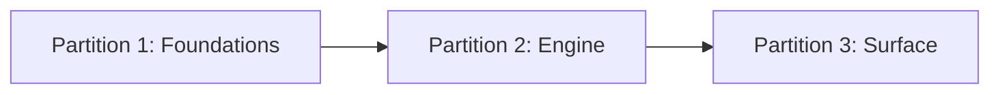

# Approach: feat-autotune

## Strategy

Three sequential feature branches, each mergeable independently. The foundation partition is the only true blocker — it introduces all shared types that the engine and surface partitions depend on. Once merged, the engine and surface can proceed without coordination risk. No parallel branches: the type dependencies are tight enough that concurrent work on different partitions would produce repeated merge conflicts on `contexts.py`, `base.py`, and `config.py`.

The implementation follows the tech design's sequencing exactly: data models before orchestration, orchestration before CLI, CLI before skill.

---

## Partitions (Feature Branches)

### Partition 1: Foundations → `feat/autotune-foundations`

**Modules**: `models/config.py`, `core/steps/base.py`, `core/contexts.py`, `core/autotune/tuning_agent.py`, `processors/autotune_template/autotune.toml`, `pyproject.toml`

**Scope**: All shared types and the TuningAgent. Nothing in this partition runs a workflow or touches the CLI — it is purely additive infrastructure that downstream partitions import.

- `TuningConfig`, `IterationMetadata`, `AutotuneRunSummary` Pydantic models added to `models/config.py`
- `EvalConfig.workflow_type` extended from `Literal["oneshot", "conversational"]` to include `"autotune"`
- `EvalConfig.tuning: Optional[TuningConfig] = None` field added
- `CompositeStep(Step)` base class added to `core/steps/base.py`
- `StepPhase.AUTOTUNE_ITERATION` and `StepPhase.TUNING` enum values added
- `IterationEvalContext` and `IterationRunContext` added to `core/contexts.py`
- `core/autotune/__init__.py` + `core/autotune/tuning_agent.py` — `TuningAgent` class using `ProviderFactory`
- `processors/autotune_template/autotune.toml` — bundled fallback meta-prompt template
- `pyproject.toml` — add `processors/autotune_template/*` to `package-data` glob
- Unit tests: `TuningAgent` (mocked `ProviderFactory`), `IterationEvalContext.get_prompt()` (real tmp TOML files), `CompositeStep.run_children()` error propagation

**Dependencies**: None (first partition)

#### Artifact Type
library

#### Acceptance Criteria
- [ ] `uv run pytest -m unit` passes with new tests for `TuningAgent`, `IterationEvalContext`, and `CompositeStep`
- [ ] `EvalConfig` with `workflow_type: "autotune"` and a `tuning` block parses without error
- [ ] `EvalConfig` without a `tuning` block (existing configs) parses without error — backward compat confirmed
- [ ] `IterationEvalContext.get_prompt("name:v2")` reads `[v2]` from a `prompts.toml` in tmp_path and returns the correct prompt text
- [ ] `IterationEvalContext.get_prompt("name:v1")` falls back to the base `LocalFileSystemEvalContext` when `prompts.toml` is absent
- [ ] `CompositeStep.run_children()` returns `False` and stops iteration when a child step's `safe_execute()` returns `False`
- [ ] `TuningAgent.generate_improved_prompt()` calls `ProviderFactory` once and returns a non-empty string
- [ ] `pyproject.toml` package-data includes `processors/autotune_template/*` — verified by importing the bundled template path from an installed package (or by confirming the glob in `pyproject.toml`)

#### Implementation Steps
1. Add `TuningConfig`, `IterationMetadata`, `AutotuneRunSummary` to `models/config.py`; extend `EvalConfig`
2. Add `AUTOTUNE_ITERATION`, `TUNING` to `StepPhase`; add `CompositeStep` to `core/steps/base.py`
3. Add `IterationEvalContext` and `IterationRunContext` to `core/contexts.py`
4. Create `core/autotune/__init__.py` and `core/autotune/tuning_agent.py`
5. Write bundled meta-prompt `processors/autotune_template/autotune.toml`
6. Update `pyproject.toml` package-data
7. Write unit tests; run `uv run pytest -m unit`

---

### Partition 2: Engine → `feat/autotune-engine`

**Modules**: `core/steps/tune_step.py`, `core/steps/autotune_iteration_step.py`, `core/workflows/autotune.py`, `reporters/autotune_reporter.py`, `reporters/templates/autotune.html`

**Scope**: The iteration loop, convergence logic, workflow orchestration, and HTML report. No CLI wiring yet — the workflow is callable from Python but not from the command line.

- `TuneStep(Step)` — reads `output_judged.jsonl`, calls `TuningAgent`, validates `{{var}}` placeholder preservation, appends vN+1 to `runs/<id>/prompts.toml`
- `AutotuneIterationStep(CompositeStep)` — full iteration loop: creates `IterationEvalContext` + `IterationRunContext` per iteration, calls `run_children()` (ScenarioProcessorStep → JudgeRunnerStep), checks all 4 convergence criteria, conditionally calls TuneStep, writes `IterationMetadata`; writes `AutotuneRunSummary` on exit
- `AutotuneWorkflow` — PrepareStep logic (copy v1 prompt to `runs/<id>/prompts.toml`), orchestrates `[ValidatorStep, AutotuneIterationStep, ReportingStep]`, handles resume via `--run` flag
- `AutotuneReporter(Jinja2Reporter)` + `reporters/templates/autotune.html` — score progression table with per-judge columns, Best Prompt section with file path and promotion instructions, convergence reason
- Unit tests: all 4 convergence criteria (`max_rounds_reached`, `target_score_achieved`, `minimal_improvement`, `performance_degraded`); `TuneStep` TOML write/read roundtrip; `AutotuneReporter._build_context()` with fixture `AutotuneRunSummary`
- Integration test: 2-iteration run with mocked `TuningAgent` and real tmp filesystem — asserts `iterations/iteration_1/` and `iterations/iteration_2/` exist, `prompts.toml` has `[v1]` and `[v2]`, `report.html` is non-empty

**Dependencies**: Partition 1 (`feat/autotune-foundations`) must be merged first

#### Artifact Type
library

#### Acceptance Criteria
- [ ] `uv run pytest -m unit` passes including all 4 convergence-criteria unit tests
- [ ] `uv run pytest -m integration` passes the 2-iteration end-to-end test
- [ ] `prompts.toml` written by `TuneStep` contains `[v1]` (copied at PrepareStep) and `[v2]` (generated by TuningAgent) with correct `avg_score` on 0.0–1.0 scale
- [ ] `AutotuneIterationStep` skips `TuneStep` on the convergence iteration (no extra LLM call)
- [ ] Generated `report.html` contains the best prompt version text and the `runs/<id>/prompts.toml` file path <!-- NEEDS MANUAL REVIEW -->
- [ ] `IterationEvalContext` causes `ScenarioProcessorStep` to render scenarios with v2 prompt text on iteration 2 (verified via captured prompts in integration test)

#### Implementation Steps
1. Implement `TuneStep` with TOML read/write and `{{var}}` preservation validation
2. Implement `AutotuneIterationStep` — iteration loop, convergence checks, `IterationMetadata` persistence
3. Implement `AutotuneWorkflow` — PrepareStep, step orchestration, resume logic
4. Implement `AutotuneReporter` and `autotune.html` template
5. Write unit tests for convergence logic, TuneStep, reporter
6. Write integration test; run full test suite

---

### Partition 3: Surface → `feat/autotune-surface`

**Modules**: `cli/commands/autotune.py`, `cli/scaffolding.py`, `tests/integration/test_autotune_workflow.py`, `skill/gavel-skill/SKILL.md`, `skill/gavel-skill/references/config-schema.md`, `skill/gavel-skill/references/cli-reference.md`

**Scope**: CLI commands, eval scaffolding, and the 7-stage agent skill autotune section. This is the user-facing shell that makes autotune accessible.

- `gavel autotune create <eval-name> [--eval-root DIR]` — scaffold autotune eval dir with all required config files
- `gavel autotune run --eval <name> [--eval-root DIR] [--run <run-id>]` — execute or resume `AutotuneWorkflow`; print Rich progress panel per iteration; print report path on completion; print Rich error panel to stderr on failure
- `cli/scaffolding.py` — `generate_autotune_templates()` function for the scaffold
- `gavel-skill/SKILL.md` autotune section — 7-stage guided setup flow (see tech-design.md §Skill Extension Specification)
- `references/config-schema.md` — add `tuning` block schema and `prompts.toml` format
- `references/cli-reference.md` — regenerated by running `scripts/update_cli_reference.py`

**Dependencies**: Partition 2 (`feat/autotune-engine`) must be merged first

#### Artifact Type
cli

#### Acceptance Criteria
- [ ] `gavel autotune create test-eval --eval-root /tmp/test` exits 0 and creates `config/eval_config.json` with `workflow_type: "autotune"` and a `tuning` block
- [ ] `gavel autotune create test-eval --eval-root /tmp/test` (run twice) exits non-zero with a clear error — does not overwrite existing eval <!-- NEEDS MANUAL REVIEW -->
- [ ] `gavel autotune run --eval <name>` with a mocked TuningAgent runs to completion and prints the report path
- [ ] `gavel autotune run --eval <name> --run <existing-run-id>` resumes from the last completed iteration (verified by checking that iteration_1/ is not re-created)
- [ ] `gavel --help` shows the `autotune` command group
- [ ] `uv run pytest -m unit && uv run pytest -m integration` passes
- [ ] Skill section covers all 7 stages from tech-design.md and includes copy-pasteable config snippets <!-- NEEDS MANUAL REVIEW -->

#### Implementation Steps
1. Implement `generate_autotune_templates()` in `cli/scaffolding.py`
2. Implement `gavel autotune create` in `cli/commands/autotune.py`
3. Implement `gavel autotune run` in `cli/commands/autotune.py`; wire up Rich progress + error display
4. Register `autotune` command group in main CLI app
5. Run `scripts/update_cli_reference.py`
6. Write the autotune section in `gavel-skill/SKILL.md` (7 stages); update `references/config-schema.md`
7. Run full test suite; manually verify scaffold output and report HTML

---

## Sequencing

Sequential. Each partition must merge to `initiative/feat-autotune` before the next begins.



### Partitions DAG

```yaml partitions
- name: feat/autotune-foundations
  modules: [models/config.py, core/steps/base.py, core/contexts.py, core/autotune/tuning_agent.py]
  depends_on: []

- name: feat/autotune-engine
  modules: [core/steps/tune_step.py, core/steps/autotune_iteration_step.py, core/workflows/autotune.py, reporters/autotune_reporter.py]
  depends_on: [feat/autotune-foundations]

- name: feat/autotune-surface
  modules: [cli/commands/autotune.py, cli/scaffolding.py, skill/gavel-skill/SKILL.md]
  depends_on: [feat/autotune-engine]
```

---

## Migrations & Compat

- **Existing `eval_config.json` files**: `EvalConfig.tuning` is `Optional[TuningConfig] = None`. All existing configs that omit the `tuning` block parse unchanged — no migration required.
- **`workflow_type` literal extension**: Adding `"autotune"` to the literal union is additive. Existing `"oneshot"` and `"conversational"` values are unaffected.
- **No database or file format migrations**: Autotune writes new files (`prompts.toml`, `run_summary.json`) that did not exist before. No existing run artifacts are touched.

---

## Risks & Mitigations

| Risk | Mitigation |
|------|------------|
| `IterationRunContext` missing an attribute that `ScenarioProcessorStep` or `JudgeRunnerStep` accesses | Before Partition 2 begins, grep all `context.` accesses in both steps and verify `IterationRunContext` satisfies the duck-type contract |
| TuningAgent drops `{{var}}` placeholders from generated prompt | Partition 2 includes explicit preservation validation with one retry; missing-placeholder failures abort the iteration cleanly |
| GEval score normalization (÷10) diverges from other judge types | `AutotuneIterationStep` normalizes per `JudgedRecord.judge_type` — deterministic (0/1) included as-is, GEval divided by 10; unit tests cover mixed judge scenarios |
| Autotune run generates many LLM calls and costs money on test runs | Integration test mocks `TuningAgent.generate_improved_prompt()` entirely; real LLM calls only happen in manual end-to-end validation |
| Resume logic reads stale iteration state | `AutotuneWorkflow.resume()` reads `IterationMetadata` from all existing `iterations/iteration_N/metadata.json` files to determine the last completed iteration before continuing |

---

## Alternatives Considered

**Inline iteration loop in `AutotuneWorkflow` (no `AutotuneIterationStep`)**: Simpler class hierarchy, but inner steps (`ScenarioProcessorStep`, `JudgeRunnerStep`) would run without `safe_execute()` wrapping. Rejected in favor of `CompositeStep` (ADR-AT-1) so inner steps get uniform error policy enforcement and OTel spans.

**One large partition (everything in one feature branch)**: Reduces branch management overhead but makes each PR review too large to be meaningful and creates a large blast radius if a late-stage bug requires rework of foundation types. Rejected.

**Reporter as a parallel partition (alongside engine)**: The reporter only needs `AutotuneRunSummary` from Partition 1, so it could be built in parallel with Partition 2. Rejected for solo-developer simplicity — the sequential approach avoids coordinating two active branches and the reporter is a small scope.
