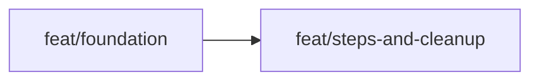

# Approach: judge-dry-fix

## Strategy

Sequential two-partition approach. The type change to `LocalRunContext.processor_results` is a hard dependency gate — every step that reads or writes `processor_results` must compile against the new type before any step logic is changed. Partition 1 establishes that gate and extracts `compute_config_hash`. Partition 2 implements all step logic, CLI changes, deletions, and test updates. No parallel partitions because the dependency chain is strictly linear and all work is in a single logical domain.

---

## Partitions (Feature Branches)

### Partition 1: Foundation → `feat/foundation`

**Modules**: `core/contexts.py`, `storage/utils.py`  
**Scope**: Add four typed step-result attributes to `LocalRunContext`. Create `storage/utils.py` with `compute_config_hash`. No behaviour changes — purely additive.  
**Dependencies**: None

#### Artifact Type
`library`

#### How to Run
No persistent process.

```
pytest -m unit
```

#### Acceptance Criteria

- [ ] `LocalRunContext()` instance has `processor_results` attribute initialised to `None` with type `Optional[List[OutputRecord]]`
- [ ] `LocalRunContext()` instance has `evaluation_results` attribute initialised to `None` with type `Optional[List[Dict[str, Any]]]`
- [ ] `LocalRunContext()` instance has `test_subject` attribute initialised to `None` with type `Optional[str]`
- [ ] `LocalRunContext()` instance has `model_variant` attribute initialised to `None` with type `Optional[str]`
- [ ] `from gavel_ai.storage.utils import compute_config_hash` imports without error
- [ ] `compute_config_hash({"agents": path, "eval_config": path2})` returns a 64-character hex string when both paths exist
- [ ] `compute_config_hash({"missing": Path("/nonexistent")})` raises `FileNotFoundError`
- [ ] All existing unit tests pass (`pytest -m unit` exits 0)
- [ ] Conversational unit tests pass (context attrs still writable by `ConversationalProcessorStep`)

#### Implementation Steps

1. Add imports to `contexts.py`: `from typing import Any` (if not present), `List` (if not present)
2. In `LocalRunContext.__init__`, after `_init_artifacts()`, add four typed instance attrs:
   ```python
   self.processor_results: Optional[List[OutputRecord]] = None
   self.evaluation_results: Optional[List[Dict[str, Any]]] = None
   self.test_subject: Optional[str] = None
   self.model_variant: Optional[str] = None
   ```
3. Create `src/gavel_ai/storage/utils.py` with `compute_config_hash` (copy from `ResultsExporter.compute_config_hash` — do not delete `ResultsExporter` yet, that is Partition 2)
4. Run `mypy src/` — verify no type errors introduced
5. Run `pytest -m unit` — verify all tests pass

---

### Partition 2: Steps & Cleanup → `feat/steps-and-cleanup`

**Modules**: `core/steps/scenario_processor.py`, `core/steps/judge_runner.py`, `core/steps/report_runner.py`, `cli/commands/oneshot.py`, `judges/rejudge.py` (delete), `storage/results_exporter.py` (delete), `judges/__init__.py`, `tests/unit/test_rejudge.py` (delete), `tests/unit/storage/test_results_exporter.py` (delete), `tests/unit/storage/test_utils.py` (new — migrated `compute_config_hash` tests), `tests/unit/steps/test_judge_runner.py`, `tests/unit/test_steps.py`, `tests/unit/steps/test_report_runner.py`  
**Scope**: All step logic changes, CLI rewrite, file deletions, test updates.  
**Dependencies**: Requires `feat/foundation`

#### Artifact Type
`library` (for step logic) + `cli` (for judge command)

#### How to Run
No persistent process for library tests.

```
pytest -m unit
```

For manual CLI smoke test:
```
gavel oneshot judge --run <run-id>
```

#### Acceptance Criteria

**ScenarioProcessorStep — multi-variant**
- [ ] Running with `eval_config.variants = ["v1", "v2"]` and 3 scenarios sets `context.processor_results` to a list of 6 `OutputRecord` objects
- [ ] Each `OutputRecord` in `context.processor_results` has `variant_id` matching the variant it was produced by
- [ ] `context.results_raw.append()` is called once per result (6 times for 2 variants × 3 scenarios)
- [ ] Running with a single variant produces the same result count as before (N records for N scenarios)

**JudgeRunnerStep — variant grouping**
- [ ] With 6 `OutputRecord` inputs (2 variants × 3 scenarios), produces 6 `EvaluationResult` dicts in `context.evaluation_results`
- [ ] Each dict in `context.evaluation_results` contains `scenario_id` and `variant_id` keys
- [ ] No `zip(scenarios, processor_results)` call exists anywhere in `judge_runner.py`

**ReportRunnerStep — OutputRecord join**
- [ ] `results_judged.jsonl` contains one entry per `OutputRecord` (correct count for multi-variant)
- [ ] Each entry in `results_judged.jsonl` has `judges` array matched by `(scenario_id, variant_id)` — not by position
- [ ] `results_judged.jsonl` entries do NOT contain a `metadata` key
- [ ] `results_raw.jsonl` is unchanged after `ReportRunnerStep` runs

**Judge CLI command**
- [ ] `gavel oneshot judge --run <run-id>` exits 0 and writes `results_judged.jsonl`
- [ ] `gavel oneshot judge --run <run-id> --judges X` exits non-zero (option removed) <!-- NEEDS MANUAL REVIEW: confirm --judges is fully removed from argument parser -->
- [ ] `gavel oneshot judge` does not contain any model resolution code (no call to `get_model_definition` outside of `JudgeRunnerStep`)

**Deletions**
- [ ] `from gavel_ai.judges.rejudge import ReJudge` raises `ImportError`
- [ ] `from gavel_ai.storage.results_exporter import ResultsExporter` raises `ImportError`
- [ ] `gavel_ai.judges` module does not export `ReJudge`

**Regression & Coverage**
- [ ] All unit tests pass (`pytest -m unit` exits 0)
- [ ] Single-variant run produces same number of `results_raw.jsonl` rows as before
- [ ] Coverage gate passes: `pytest --cov=gavel_ai --cov-fail-under=70 -m unit` exits 0

#### Implementation Steps

Follow the sequence from tech-design.md §Implementation Sequence:

1. **`scenario_processor.py`**
   - Add `_make_output_record()` helper function (see tech-design ADR-2 for signature)
   - Replace single-variant block with outer loop over `eval_config.variants`
   - Replace `exporter.append_raw_result(...)` with `context.results_raw.append(record)` using the `OutputRecord` from `_make_output_record()`
   - Set `context.test_subject` = first variant's test subject name
   - Set `context.model_variant` = `", ".join(eval_config.variants)` (display only)
   - Set `context.processor_results = all_records` (flat `List[OutputRecord]`)
   - Remove `ResultsExporter` import

2. **`judge_runner.py`**
   - Add `from collections import defaultdict` import
   - Replace `zip(scenarios, processor_results, strict=True)` with `scenario_map` + `groupby(variant_id)` pattern
   - Call `judge_executor.execute_batch()` once per variant group
   - Flatten results: `context.evaluation_results = [r.model_dump() for r in all_results]`
   - Remove `test_subject` read from context (use `context.test_subject or "unknown"` for display only)

3. **`report_runner.py`**
   - Replace `exporter.export_judged_results(...)` with inline `(scenario_id, variant_id)` join
   - Use `run_context.results_judged.append(entry)` for each record (via `RecordDataSource`)
   - Use `record.model_dump(exclude={"metadata"})` when building each entry
   - Replace `exporter.compute_config_hash(...)` with `compute_config_hash(...)` from `gavel_ai.storage.utils`
   - Update `variant_count` in manifest to `len(eval_config.variants)`
   - Remove `ResultsExporter` import

4. **`cli/commands/oneshot.py`**
   - Remove `from gavel_ai.judges.rejudge import ReJudge` import
   - Remove `get_model_definition` import
   - Rewrite `judge` command body: load `OutputRecord` list via `run_ctx.results_raw.read()`, set `context.processor_results`, run `JudgeRunnerStep` + `ReportRunnerStep`
   - Remove `--judges` option
   - Remove all model resolution code from the command

5. **Delete source files**
   - Delete `src/gavel_ai/judges/rejudge.py`
   - Delete `src/gavel_ai/storage/results_exporter.py`
   - Remove `ReJudge` from `src/gavel_ai/judges/__init__.py`
   - Verify zero remaining references: `grep -r "ResultsExporter\|results_exporter\|ReJudge\|rejudge" src/` must return empty

6. **Delete matching test files**
   - Delete `tests/unit/test_rejudge.py` (tests `ReJudge` — deleted with source)
   - Delete `tests/unit/storage/test_results_exporter.py` (tests `ResultsExporter` — deleted with source)
   - Verify no orphaned imports: `pytest --collect-only -q` must not report import errors

7. **Migrate `compute_config_hash` tests**
   - Create `tests/unit/storage/test_utils.py`
   - Move the 5 `compute_config_hash` test cases from `test_results_exporter.py` — update import to `from gavel_ai.storage.utils import compute_config_hash`
   - Tests to migrate: `test_compute_config_hash_returns_consistent_hash`, `test_compute_config_hash_deterministic_ordering`, `test_compute_config_hash_different_for_different_content`, `test_compute_config_hash_raises_file_not_found`, `test_compute_config_hash_handles_multiple_files`

8. **Update step tests**
   - `tests/unit/test_steps.py`: replace `ProcessorResult` mocks with `OutputRecord` mocks in `ScenarioProcessorStep` tests; add 2-variant test asserting 2×N records
   - `tests/unit/steps/test_judge_runner.py`: update mocks for `List[OutputRecord]` input; update any assertion of `variant_id == "subject_agent"` (was a bug — now reflects real variant); add multi-variant grouping test
   - `tests/unit/steps/test_report_runner.py`: update to pass `List[OutputRecord]` in context; add assertion that join is on `(scenario_id, variant_id)` not position; assert no `metadata` key in written entries
   - `tests/unit/test_deepeval_judge.py`: no changes expected — judge impls untouched

7. **Final verification**
   - `pytest -m unit` passes
   - `mypy src/` passes

---

## Sequencing

Partition 1 must merge before Partition 2 can start. No parallelism.



### Partitions DAG

```yaml partitions
- name: feat/foundation
  modules: [core/contexts.py, storage/utils.py]
  depends_on: []

- name: feat/steps-and-cleanup
  modules: [core/steps/scenario_processor.py, core/steps/judge_runner.py, core/steps/report_runner.py, cli/commands/oneshot.py, judges/rejudge.py, storage/results_exporter.py, judges/__init__.py, tests/unit/test_rejudge.py, tests/unit/storage/test_results_exporter.py, tests/unit/storage/test_utils.py]
  depends_on: [feat/foundation]
```

---

## Migrations & Compat

- **No data migration** — `results_raw.jsonl` and `results_judged.jsonl` schemas are unchanged.
- **`results_judged.jsonl`** — `metadata` field is now excluded. This is a no-op for existing readers (they ignore unknown/missing fields). New files will not contain `metadata` per row; this is intentional (see tech-design ADR-5).
- **`manifest.json`** — `variant_count` corrected from hardcoded `1` to actual count. Additive for readers.
- **Conversational pipeline** — not touched. `context.test_subject` and `context.model_variant` remain writable on `LocalRunContext`.

---

## Risks & Mitigations

| Risk | Mitigation |
|------|------------|
| `RecordDataSource.append()` doesn't support single-record streaming | Verify `RecordDataSource` API before implementing Partition 2, step 1. If missing, add `append()` to `RecordDataSource` as a prerequisite micro-task. |
| Conversational tests break after typed attr addition | Run `pytest -m unit` after Partition 1, step 2 before continuing. Check `ConversationalProcessorStep` sets `test_subject` and `model_variant` — these are now typed as `Optional[str]`, compatible with existing assignments. |
| Missed callsite of `ResultsExporter` | `grep -r "ResultsExporter\|results_exporter" src/` before deleting — must be zero hits. |
| Missed callsite of `ReJudge` | `grep -r "ReJudge\|rejudge" src/` before deleting — must be zero hits. |
| `JudgeRunnerStep` currently passes `"subject_agent"` as `variant_id` to `execute_batch` — EvaluationResult.variant_id will change | This is a correctness fix, not a regression. After the change, `variant_id` in `EvaluationResult` matches the actual model variant. Existing tests that assert `variant_id == "subject_agent"` must be updated. |

---

## Alternatives Considered

**Single partition (everything in one branch)**: Simpler branch management, but mixes the foundation type change with all step logic. If `contexts.py` causes a type error cascade, it's harder to isolate. Two partitions gives a clean merge checkpoint with verified types before step logic changes.

**Three partitions (foundation / steps / CLI+cleanup)**: Slightly cleaner separation of concerns, but the CLI rewrite and deletions are only safe after all steps are updated — no parallelism is unlocked, so three partitions adds overhead with no benefit over two.
