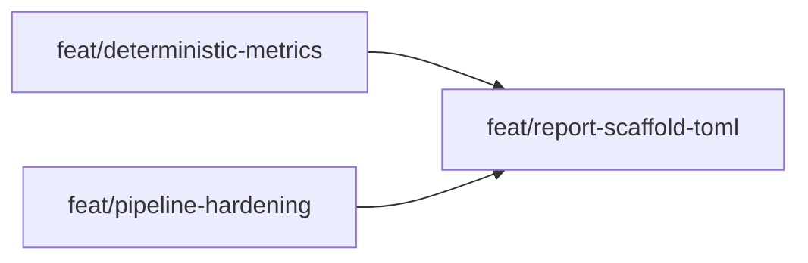

---
summary: "Three sequential-then-parallel partitions. P1 (deterministic-metrics) and P2 (pipeline-hardening) are fully parallel — zero module overlap. P3 (report-scaffold-toml) is sequential, depending on both. P1 establishes the DeterministicMetric class hierarchy and JudgeRunnerStep routing. P2 hardens the pipeline: snapshot prompts, step tracking, expanded validator. P3 closes out: HTML report section, score averaging exclusion, scaffolding templates, in-situ fix, and TOML judge config resolution."
phase: "approach"
when_to_load:
  - "When starting registered feature branches or reviewing partition scope, sequencing, and dependencies."
  - "When deciding what work can proceed in parallel and what must wait."
depends_on:
  - "prd.md"
  - "ux.md"
  - "tech-design.md"
modules:
  - "src/gavel_ai/judges"
  - "src/gavel_ai/core/steps"
  - "src/gavel_ai/core/contexts.py"
  - "src/gavel_ai/cli"
  - "src/gavel_ai/reporters"
  - "src/gavel_ai/models"
index:
  strategy: "## Strategy"
  partitions: "## Partitions (Feature Branches)"
  sequencing: "## Sequencing"
  migrations_compat: "## Migrations & Compat"
  risks: "## Risks & Mitigations"
  alternatives: "## Alternatives Considered"
next_section: null
---

# Approach: finish-oneshot

## Strategy

Three partitions. Two run in parallel (P1 and P2 share zero modules), then P3 runs sequentially after both merge. This allows the deterministic metric work and the pipeline hardening work to proceed independently, with the report + scaffold layer closing out once both foundations are in place.

All changes are additive or narrow surgical fixes to existing files. No new service layer, no schema migrations, no breaking API changes.

---

## Partitions (Feature Branches)

### Partition 1: Deterministic Metrics → `feat/deterministic-metrics`

**Modules**: `src/gavel_ai/judges/deterministic_metric.py` (new), `src/gavel_ai/judges/judge_registry.py`, `src/gavel_ai/core/steps/judge_runner.py`, `src/gavel_ai/models/runtime.py`, `pyproject.toml`, `tests/unit/judges/`

**Scope**: Implement `DeterministicMetric` base class, `ClassifierMetric`, and `RegressionMetric`. Register in `JudgeRegistry`. Add routing logic to `JudgeRunnerStep` to partition judge configs into LLM judges (existing path) and deterministic metrics (new inline loop). Add `PerSampleDeterministicResult` and `DeterministicRunResult` models. Add `scikit-learn` dependency.

**Dependencies**: None (parallel with P2)

#### Artifact Type
`library`

#### How to Run
- `python -m pytest tests/unit/judges/test_deterministic_metric.py -v`
- `python -m pytest -m unit -v`

#### Acceptance Criteria
- [ ] `ClassifierMetric.evaluate_sample()` returns `match=True` when prediction equals actual (case-insensitive strip)
- [ ] `ClassifierMetric.evaluate_sample()` returns `match=False` on mismatch; `raw_score=None`
- [ ] `ClassifierMetric.compute()` returns correct `accuracy` population metric for a known 3-sample fixture (2 correct, 1 wrong → 0.667)
- [ ] `RegressionMetric.evaluate_sample()` returns correct unbounded signed `raw_score` (e.g. prediction=3.5, actual=2.0 → raw_score=1.5); `match=None`
- [ ] `RegressionMetric.compute()` returns correct `mean_absolute_error` for a known fixture
- [ ] Both metrics return `PerSampleDeterministicResult(skip_reason="outputs is not a dict")` when `processor_output` is not valid JSON
- [ ] Both metrics return `skip_reason="prediction_field not found: <path>"` when dotted path is absent
- [ ] `compute()` returns `population_score=None` when all samples are skipped
- [ ] `JudgeRegistry.create(cfg)` with `type="classifier"` returns a `ClassifierMetric` instance
- [ ] `JudgeRegistry.create(cfg)` with `type="regression"` returns a `RegressionMetric` instance
- [ ] `JudgeRunnerStep.execute()` sets `context.deterministic_metrics` with one `DeterministicRunResult` per deterministic metric config
- [ ] `JudgeRunnerStep.execute()` still sets `context.evaluation_results` correctly for LLM judges when both LLM and deterministic configs are present in the same run
- [ ] `pytest -m unit` passes with no regressions

#### Implementation Steps
1. Add `PerSampleDeterministicResult` and `DeterministicRunResult` to `src/gavel_ai/models/runtime.py`
2. Create `src/gavel_ai/judges/deterministic_metric.py`:
   - `DeterministicMetric(ABC)` base: `__init__`, `evaluate_sample()`, `compute()`
   - `ClassifierMetric(DeterministicMetric)`: dotted-path extract, case-insensitive match, scikit-learn population metric
   - `RegressionMetric(DeterministicMetric)`: dotted-path extract, unbounded signed error, scikit-learn population metric
   - Module-level registration calls: `JudgeRegistry.register("classifier", ClassifierMetric)` and `JudgeRegistry.register("regression", RegressionMetric)` at bottom of file
3. Add `scikit-learn>=1.4,<2.0` to `pyproject.toml`
4. Modify `src/gavel_ai/judges/judge_registry.py`: ensure `create()` can return `DeterministicMetric` (no type narrowing that assumes `Judge`)
5. Modify `src/gavel_ai/core/steps/judge_runner.py`:
   - Import `DeterministicMetric`
   - After building `judges_list`, partition into `llm_configs` and `det_configs` using `isinstance(JudgeRegistry.create(cfg), DeterministicMetric)`
   - Pass `llm_configs` to `JudgeExecutor` as before
   - Add inline loop for `det_configs`: instantiate metric, call `evaluate_sample()` per record, call `compute()`, collect into `context.deterministic_metrics`
6. Write `tests/unit/judges/test_deterministic_metric.py` with full coverage per acceptance criteria

---

### Partition 2: Pipeline Hardening → `feat/pipeline-hardening`

**Modules**: `src/gavel_ai/core/contexts.py`, `src/gavel_ai/core/steps/base.py`, `src/gavel_ai/core/steps/validator.py`, `tests/unit/core/`

**Scope**: (OS-4) Extend `snapshot_run_config()` to copy `config/prompts/` and write `snapshot_metadata.json`. (OS-6) Add `mark_step_complete()` / `get_completed_steps()` to `RunContext` ABC and `LocalRunContext`; add `StepPhase.PREPARE`; call `mark_step_complete` in `safe_execute()`. (OS-5) Re-enable variant resolution, prompt existence check, judge type warning, and scenario count check in `ValidatorStep`. (OS-2 prep) Add `get_judge_config(name)` to `LocalFileSystemEvalContext` for TOML loading — used by P3.

**Dependencies**: None (parallel with P1)

#### Artifact Type
`library`

#### How to Run
- `python -m pytest tests/unit/core/ -v`
- `python -m pytest -m unit -v`

#### Acceptance Criteria
- [ ] After `LocalRunContext.__init__()`, `.workflow_status` file exists in the run directory containing a `{"step": "prepare", ...}` JSONL entry
- [ ] After a successful `Step.safe_execute()`, `.workflow_status` contains the step's phase value as a new entry
- [ ] `get_completed_steps()` returns `[StepPhase.PREPARE, StepPhase.VALIDATION]` after those two complete successfully
- [ ] `snapshot_run_config()` copies all `.toml` files from `config/prompts/` into `.config/prompts/`
- [ ] `snapshot_run_config()` writes `.config/snapshot_metadata.json` with `snapshotted_at` and `files` keys
- [ ] `snapshot_run_config()` does not raise when `config/prompts/` does not exist
- [ ] `ValidatorStep` raises `ConfigError` when a `prompt_name` in `test_subjects` does not have a corresponding file in `config/prompts/` (local evals only)
- [ ] `ValidatorStep` emits a warning (no raise) when a judge type is not registered in `JudgeRegistry`
- [ ] `ValidatorStep` raises `ValidationError` when scenario list is empty
- [ ] `ValidatorStep` successfully resolves a variant that references an agent name (not a direct model name)
- [ ] `LocalFileSystemEvalContext.get_judge_config("quality_judge")` loads `config/judges/quality_judge.toml` and returns a dict with `criteria`, `evaluation_steps`, `threshold`
- [ ] `get_judge_config()` raises `ConfigError` (not `FileNotFoundError`) when the TOML file is absent
- [ ] `pytest -m unit` passes with no regressions

#### Implementation Steps
1. Add `StepPhase.PREPARE = "prepare"` to the enum in `src/gavel_ai/core/steps/base.py`
2. Add abstract methods `mark_step_complete(phase: StepPhase)` and `get_completed_steps() -> List[StepPhase]` to `RunContext` ABC in `src/gavel_ai/core/contexts.py`
3. Implement both on `LocalRunContext`: append-only JSONL to `{run_dir}/.workflow_status`; `LocalRunContext.__init__()` writes the `PREPARE` entry after `snapshot_run_config()` completes
4. Extend `LocalRunContext.snapshot_run_config()`: copy `config/prompts/` tree into `.config/prompts/`; write `.config/snapshot_metadata.json`
5. Add `get_judge_config(name: str) -> Dict` to `LocalFileSystemEvalContext`: load `config/judges/{name}.toml` via `tomllib`; cache in `_judge_config_cache`; raise `ConfigError` on missing file
6. Modify `Step.safe_execute()` in `base.py`: call `context.mark_step_complete(self.phase)` on success (after `await self.execute(context)`)
7. Modify `ValidatorStep`: re-enable and fix variant resolution block (gate on `test_subject_type == "local"`); add prompt existence check (gate on `local`); add judge type warning; re-enable scenario count check
8. Verify `tomllib` availability — if Python min version < 3.11, add `tomli` as conditional dep and import appropriately
9. Write tests: `tests/unit/core/test_contexts_snapshot.py`, `tests/unit/core/test_step_tracking.py`, `tests/unit/core/test_validator_expanded.py`

---

### Partition 3: Report, Scaffold & TOML → `feat/report-scaffold-toml`

**Modules**: `src/gavel_ai/models/runtime.py`, `src/gavel_ai/core/steps/judge_runner.py`, `src/gavel_ai/core/steps/report_runner.py`, `src/gavel_ai/reporters/oneshot_reporter.py`, `src/gavel_ai/reporters/templates/oneshot.html`, `src/gavel_ai/cli/commands/oneshot.py`, `src/gavel_ai/cli/scaffolding.py`

**Scope**: (OS-8) Add `DeterministicRunResult` to `ReportData`; extend reporter and HTML template for deterministic judge section. (OS-7) Exclude error processor outputs from judge score averages; show `(N skipped)` annotation. (OS-2) Wire `config_ref` → `get_judge_config()` resolution in `JudgeRunnerStep`. (OS-3) Add `--template classification|regression` to `oneshot create`. (OS-9) Fix in-situ scaffold. Write example `quality_judge.toml` to scaffold.

**Dependencies**: Requires `feat/deterministic-metrics` (P1) and `feat/pipeline-hardening` (P2)

#### Artifact Type
`cli`

#### How to Run
- `python -m pytest tests/unit/ -v`
- `python -m pytest -m unit -v`
- `gavel oneshot create --eval test_cls --template classification` (manual smoke test)
- `gavel oneshot create --eval test_insitu --type in-situ` (manual smoke test)

#### Acceptance Criteria
- [ ] `gavel oneshot create --eval foo --template classification` exits 0 and produces `eval_config.json` containing `"type": "classifier"` in judges
- [ ] `gavel oneshot create --eval foo --template regression` exits 0 and produces `eval_config.json` containing `"type": "regression"` in judges
- [ ] `gavel oneshot create --eval foo --type in-situ` exits 0 and produces `eval_config.json` with `"test_subject_type": "in-situ"`; no `prompts/assistant.toml` generated
- [ ] `gavel oneshot create --eval foo --template unknown` exits non-zero with message naming available templates
- [ ] Scaffold for `--template classification` generates `config/judges/quality_judge.toml` example file
- [ ] A judge config with `"config_ref": "quality_judge"` resolves to the TOML file contents at run time; `gavel oneshot run` proceeds without error
- [ ] A judge config with `config_ref` pointing to a missing file causes `gavel oneshot run` to exit with `Error: Judge config file not found: config/judges/quality_judge.toml — Create the file or remove the config_ref field`
- [ ] `OneShotReporter._build_context()` excludes from judge score averages any result where the corresponding `OutputRecord.error` is not None; a fixture with 1 error out of 3 produces correct average over 2 samples
- [ ] Report HTML contains `(1 skipped)` annotation when one score was excluded for a given variant/judge
- [ ] Report HTML contains a `Deterministic Judges` section when `deterministic_results` is non-empty
- [ ] The deterministic section renders `prediction | actual | match` columns for classifier results and `prediction | actual | error` columns for regression results
- [ ] The deterministic section shows `N/A (0 samples)` for population_score when all samples were skipped
- [ ] `pytest -m unit` passes with no regressions

#### Implementation Steps
1. Add `deterministic_results: List[DeterministicRunResult] = []` to `ReportData` in `models/runtime.py`
2. Add `raw_results` and `deterministic_metrics` fields to `RunData` dataclass in `report_runner.py`; pass `processor_results` as `raw_results` and `context.deterministic_metrics` as `deterministic_metrics` when constructing `RunData`
3. Modify `JudgeRunnerStep.execute()`: before instantiating `JudgeExecutor`, check each `judge_config.config_ref`; if set, call `context.eval_context.get_judge_config(config_ref)` and merge result into `judge_config.config`
4. Modify `OneShotReporter._build_context()`:
   - Build `processor_errors: Dict[Tuple[str,str], bool]` from `run.raw_results` (key: `(scenario_id, variant_id)`, value: `record["error"] is not None`)
   - Skip a judge score from sum/count when `processor_errors.get((scenario_id, variant_id))` is truthy; track `skipped_count` per `(variant, judge)`
   - Read `run.deterministic_metrics` and populate `report_data.deterministic_results`
5. Extend `oneshot.html` Jinja2 template:
   - Add `(N skipped)` span next to any judge average where `skipped_count > 0`
   - Add "Deterministic Judges" section after LLM summary table; render `prediction | actual | match` (classifier) or `prediction | actual | error` (regression) columns per sample; show population metric value; show `N/A (0 samples)` when skipped
6. Modify `src/gavel_ai/cli/commands/oneshot.py` `create()`: add `--template` `typer.Option` with `help` listing `default`, `classification`, `regression`
7. Modify `src/gavel_ai/cli/scaffolding.py`:
   - `generate_all_templates()`: dispatch on `template` arg to `_generate_classification_templates()` or `_generate_regression_templates()`
   - `_generate_classification_templates()`: write `eval_config.json` with `ClassifierMetric` judges, `scenarios.json` with 3 samples (one wrong expected), `prompts/classifier.toml`
   - `_generate_regression_templates()`: write `eval_config.json` with `RegressionMetric` judge, `scenarios.json` with 3 numeric samples, `prompts/regressor.toml`
   - All templates: write example `config/judges/quality_judge.toml`
   - Fix `generate_eval_config()` for `eval_type == "in-situ"`: set `test_subject_type: "in-situ"`, remote endpoint structure, skip prompt generation

---

## Sequencing

P1 and P2 are fully parallel — no shared files. P3 is sequential after both.



### Partitions DAG

> This block is machine-readable. It drives automatic worktree creation in `branch.py`.
> - `depends_on: []` → partition runs in parallel (gets its own git worktree)
> - `depends_on: [feat/x]` → partition is sequential (plain branch, waits for dependency)

```yaml partitions
- name: feat/deterministic-metrics
  modules: [judges/deterministic_metric.py, judges/judge_registry.py, core/steps/judge_runner.py, models/runtime.py, pyproject.toml]
  depends_on: []

- name: feat/pipeline-hardening
  modules: [core/contexts.py, core/steps/base.py, core/steps/validator.py]
  depends_on: []

- name: feat/report-scaffold-toml
  modules: [models/runtime.py, core/steps/judge_runner.py, core/steps/report_runner.py, reporters/oneshot_reporter.py, reporters/templates/oneshot.html, cli/commands/oneshot.py, cli/scaffolding.py]
  depends_on: [feat/deterministic-metrics, feat/pipeline-hardening]
```

---

## Migrations & Compat

All changes are additive. No existing data files, CLI flags, or config schemas are removed or renamed.

- `ReportData.deterministic_results` defaults to `[]` — existing report calls are unaffected.
- `RunData` gains two optional fields with defaults — existing `RunData` construction sites are unaffected.
- `RunContext` ABC gains two abstract methods — only `LocalRunContext` exists today, so no hidden subclass breakage.
- `JudgeResult` schema is unchanged.
- `results_raw.jsonl` and `results_judged.jsonl` formats are unchanged.
- `StepPhase.PREPARE` is additive to the enum.
- The `--template` flag on `oneshot create` is optional with `default="default"` — existing usage unchanged.

---

## Risks & Mitigations

| Risk | Mitigation |
|------|------------|
| `tomllib` not available on Python 3.10 | Check `pyproject.toml` `requires-python` before starting P2; add `tomli` as conditional dep if needed |
| P3 touches files already changed by P1 (`models/runtime.py`, `judge_runner.py`) — merge conflicts if P1 doesn't merge cleanly before P3 branches | P3 is strictly sequential; it branches from the initiative branch *after* both P1 and P2 are merged. DAG enforces this. |
| `ValidatorStep` variant resolution fix changes behavior for existing evals | Gate strictly on `test_subject_type == "local"`; add regression tests using existing fixture configs before enabling |
| scikit-learn `fbeta` requires explicit `beta` field — missing it causes a runtime error | Validate at judge instantiation time in `ClassifierMetric.__init__()`: raise `ConfigError` if `report_metric == "fbeta"` and `beta` is absent from config |
| `GEval` criteria/evaluation_steps are configured at metric creation time, but scenario context is not available until `evaluate()` — deferred rendering requires reconstructing `GEval` per call | This is an OS-10 concern (not in this initiative's scope). Flag in code with a `# TODO: OS-10` comment at the relevant site. |

---

## Alternatives Considered

**Single sequential partition** — simpler branch management but loses the parallelism opportunity on two fully independent workstreams. Rejected: P1 and P2 have zero module overlap and the parallel path is safe.

**Four partitions (split P3 into report and scaffold)** — P3's report and scaffold work also have no module overlap. Rejected: the gain is marginal for a small number of files, and keeping them together reduces total merge surface.

**DeterministicMetric extends Judge** — lets it pass through `JudgeExecutor` unchanged. Rejected in ADR-1: forces `JudgeResult.score` onto unbounded regression values; produces misleading output artifacts; semantically wrong.
