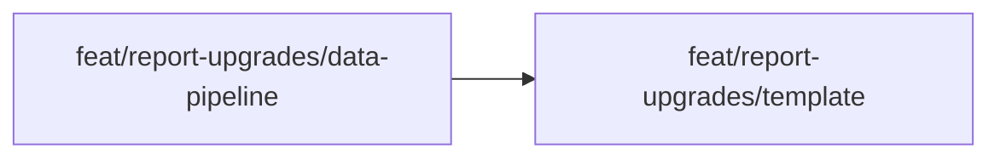

---
summary: "Two sequential feature branches: (1) data-pipeline — extend report_runner.py and oneshot_reporter.py to supply execution time, subject names, input source, scenario count, and collapse thresholds to the template context; (2) template — rewrite all four sections of oneshot.html (header, Eval Summary, Performance Summary, Scenario Detail) to match the target design. Template depends on data-pipeline. No new Python dependencies. Tests updated in partition 2."
phase: "approach"
when_to_load:
  - "When starting registered feature branches or reviewing partition scope, sequencing, and dependencies."
  - "When deciding what work can proceed in parallel and what must wait."
depends_on:
  - "prd.md"
  - "ux.md"
  - "tech-design.md"
modules:
  - "src/gavel_ai/reporters/oneshot_reporter.py"
  - "src/gavel_ai/core/steps/report_runner.py"
  - "src/gavel_ai/reporters/templates/oneshot.html"
index:
  strategy: "## Strategy"
  partitions: "## Partitions (Feature Branches)"
  sequencing: "## Sequencing"
  migrations_compat: "## Migrations & Compat"
  risks: "## Risks & Mitigations"
  alternatives: "## Alternatives Considered"
next_section: "done"
---

# Approach: Report Upgrades

## Strategy

Sequential, two-partition approach. The template requires the new context variables from the reporter before it can be properly verified — so partition 1 (data pipeline) must land first. Partition 2 (template) can then be developed and verified with real run output.

Both partitions are small enough for a single developer/agent. The split provides a clean Python-only review (partition 1) before the larger HTML/CSS/JS change (partition 2).

## Partitions (Feature Branches)

### Partition 1: Data Pipeline → `feat/report-upgrades/data-pipeline`

**Modules**: `src/gavel_ai/core/steps/report_runner.py`, `src/gavel_ai/reporters/oneshot_reporter.py`  
**Scope**: Extend `RunData.metadata` with `input_source` and `subject_names`; add `INPUT_COLLAPSE_THRESHOLD`, `RESPONSE_TRUNCATE_THRESHOLD` constants; extend `_build_context` to emit `total_execution_time_s`, `input_source`, `subject_names`, `scenario_count`, and threshold constants into the template context dict.  
**Dependencies**: None

#### Artifact Type
library

#### Acceptance Criteria
- [ ] `OneShotReporter._build_context` returns `total_execution_time_s` matching `run.telemetry["total_duration_seconds"]`
- [ ] `_build_context` returns `None` for `total_execution_time_s` when `telemetry` dict is empty (graceful fallback)
- [ ] `_build_context` returns `input_source` string formatted as `"{source} ({name})"` when metadata is present
- [ ] `_build_context` returns `subject_names` list from `run.metadata["subject_names"]`
- [ ] `_build_context` returns `input_collapse_threshold = 200` and `response_truncate_threshold = 500`
- [ ] `ReportRunnerStep` populates `metadata["input_source"]` and `metadata["subject_names"]` in `RunData`
- [ ] All existing unit tests pass (`pytest -m unit`)

#### Implementation Steps
1. Add `INPUT_COLLAPSE_THRESHOLD = 200` and `RESPONSE_TRUNCATE_THRESHOLD = 500` constants to `oneshot_reporter.py`
2. Extend `ReportRunnerStep.execute()` to add `input_source` and `subject_names` to `RunData.metadata`
3. Extend `OneShotReporter._build_context()` to extract and pass all new context keys
4. Add/update unit tests for new context key extraction and graceful fallbacks

---

### Partition 2: Template → `feat/report-upgrades/template`

**Modules**: `src/gavel_ai/reporters/templates/oneshot.html`, `tests/`  
**Scope**: Rewrite all four report sections to match the target design: header (execution time + eval label), Eval Summary (subject sub-heading + LLM/deterministic split), Performance Summary (subject sub-heading + column rename), Scenario Detail (table layout + collapsible input + truncated response + score row).  
**Dependencies**: Requires Partition 1 (data-pipeline)

#### Artifact Type
library

#### How to Run
- Generate a report against a real eval run to visually verify:
  ```
  uv run gavel oneshot report --run-dir .gavel/evaluations/media-lens-headline-extraction/runs/run-20260414-075639
  ```
  _(or regenerate via `uv run gavel oneshot run` on a small eval)_
- Open the generated `report.html` in a browser

#### Acceptance Criteria
- [ ] Header `<h1>` text is "OneShot Evaluation Report" (not the eval name)
- [ ] Header metadata row contains "Evaluation:", "Run ID:", "Overall Execution Time:", "Generated:"
- [ ] Eval Summary heading text is "Eval Summary"
- [ ] Eval Summary renders `<h4>LLM Judges</h4>` sub-heading when LLM judges exist
- [ ] Eval Summary "LLM Avg" column header present (not "Overall Avg")
- [ ] Eval Summary renders `<h4>Deterministic Metrics</h4>` and population-score table when deterministic results exist
- [ ] Performance Summary renders test-subject sub-heading above each table
- [ ] Performance Summary column header reads "Avg Response Time" (not "Avg Turn Time")
- [ ] Scenario detail uses `<table>` layout with variant names as `<th>` column headers
- [ ] Scenario input > 200 chars is collapsed by default with "expand" button
- [ ] Scenario input ≤ 200 chars is shown inline without a toggle
- [ ] Model response > 500 chars shows truncated preview with "expand" button
- [ ] Variants with no judgments show "No scoring data" in scoring cell
- [ ] Scenario header shows test-subject name float-right
- [ ] Report renders without JS errors for the `media-lens-headline-extraction` run <!-- NEEDS MANUAL REVIEW -->
- [ ] Report file size for `media-lens-headline-extraction` run is < 200 KB <!-- NEEDS MANUAL REVIEW -->
- [ ] All existing unit and integration tests pass (`pytest -m unit && pytest -m integration`)

#### Implementation Steps
1. Copy all new CSS classes from draft `report.html` into `oneshot.html` `<style>` block
2. Copy `toggleInput`, `toggleTruncated` JS functions into `<script>` block; keep `toggleReasoning`
3. Replace `<header>` block
4. Replace `<section id="summary">` block (Eval Summary)
5. Update `<section id="performance">` block (Performance Summary)
6. Replace scenario detail section (table layout, collapsible input, truncated response, score row)
7. Update integration test assertions for new HTML structure

---

## Sequencing



### Partitions DAG

```yaml partitions
- name: feat/report-upgrades/data-pipeline
  modules: [src/gavel_ai/core/steps/report_runner.py, src/gavel_ai/reporters/oneshot_reporter.py]
  depends_on: []

- name: feat/report-upgrades/template
  modules: [src/gavel_ai/reporters/templates/oneshot.html]
  depends_on: [feat/report-upgrades/data-pipeline]
```

---

## Migrations & Compat

No data migration required. The generated `report.html` is a transient artifact — old reports are not regenerated. New reports will use the updated template from the moment the initiative merges to master.

The only compatibility concern is tests that assert on report HTML structure. These are updated in partition 2, task 7.

---

## Risks & Mitigations

| Risk | Mitigation |
|------|------------|
| `subject_names` empty when `eval_config.test_subjects` has no `prompt_name` set | Fall back to extracting unique `test_subject` values from results in `_build_context`; template uses `......` fallback |
| Integration test asserts on old HTML structure and blocks CI | Update assertions in partition 2 step 7 before committing |
| Large scenario inputs still slow to parse/render in browser even when hidden | Acceptable for v1; Post-MVP can omit DOM content above a higher threshold |

---

## Alternatives Considered

**Single flat partition:** All changes in one branch. Rejected because Python reporter changes and HTML template changes are cleanly separable and benefit from independent review.

**Three partitions (data / template-structure / scenario-detail):** Overly granular for this scope. Template sections 3–6 are independent within the file but do not benefit from separate branches — they share CSS and JS and must be tested together.
