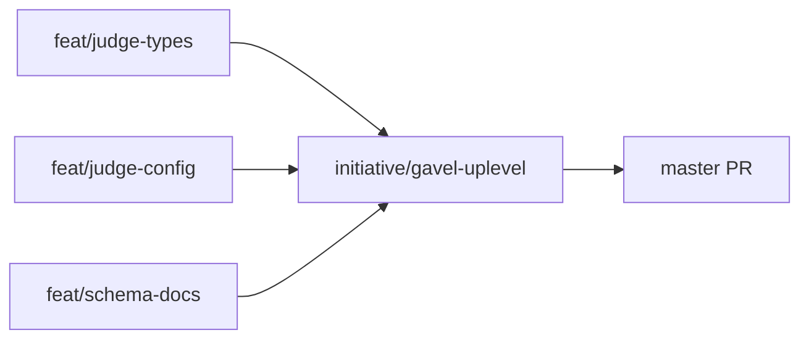

# Approach: gavel-uplevel

## Strategy

The majority of the 11 FR areas are already implemented. The remaining four items — FR-2, FR-3.3, FR-5, FR-11 — are independent of each other and touch non-overlapping modules. The strategy is to build them in three parallel feature branches, merge each to `initiative/gavel-uplevel` as it completes, and ship the initiative with a single PR to master.

No database, no migrations, no breaking API changes. All work is purely additive to existing modules or new documentation files.

---

## Partitions (Feature Branches)

### Partition 1: DeepEval Judge Types → `feat/judge-types`

**Modules**: `src/gavel_ai/judges/deepeval_judge.py`

**Scope**: Add `ToxicityMetric`, `ConversationCompletenessMetric`, `ConversationalGEval`, and `TurnRelevancyMetric` to `JUDGE_TYPE_MAP` in `DeepEvalJudge`. Add unit tests. Update CLI help text with recommended thresholds per FR-2.3.

**Dependencies**: None

#### Artifact Type

library

#### How to Run

_(No persistent process — library partition)_

- test: `uv run pytest tests/ -m unit -k "deepeval" -v`

#### Acceptance Criteria

- [ ] `DeepEvalJudge.JUDGE_TYPE_MAP` contains key `"deepeval.toxicity"` → `ToxicityMetric`
- [ ] `DeepEvalJudge.JUDGE_TYPE_MAP` contains key `"deepeval.conversation_completeness"` → `ConversationCompletenessMetric`
- [ ] `DeepEvalJudge.JUDGE_TYPE_MAP` contains key `"deepeval.conversational_geval"` → `ConversationalGEval`
- [ ] `DeepEvalJudge.JUDGE_TYPE_MAP` contains key `"deepeval.turn_relevancy"` → `TurnRelevancyMetric`
- [ ] `JudgeRegistry.create(JudgeConfig(type="deepeval.toxicity", ...))` returns a `DeepEvalJudge` instance without raising
- [ ] Unit tests pass for all 4 new types (mocked deepeval metrics, consistent with existing test pattern)
- [ ] `gavel oneshot create --help` output contains threshold guidance text for Toxicity and ConversationCompleteness <!-- NEEDS MANUAL REVIEW -->
- [ ] Module loads successfully when deepeval is not installed (no ImportError at import time) <!-- NEEDS MANUAL REVIEW -->

#### Implementation Steps

1. Verify the 4 new types are importable from the version of `deepeval` pinned in `pyproject.toml`; if any are unavailable, add a conditional guard with a clear `ConfigError` message.
2. Add imports for the 4 new types inside the existing `try: from deepeval... except ImportError: pass` block in `deepeval_judge.py`.
3. Add all 4 entries to `JUDGE_TYPE_MAP`.
4. Add unit tests in `tests/unit/` using mocked deepeval metric classes.
5. Update CLI help text in `cli/commands/oneshot.py` to add threshold guidance per FR-2.3.

---

### Partition 2: Judge Config Enhancements → `feat/judge-config`

**Modules**: `src/gavel_ai/core/steps/judge_runner.py`, `src/gavel_ai/models/config.py`

**Scope**: Two closely related judge config resolution features that both live in `judge_runner.py`:
- **FR-3.3**: `markdown_path` field on a judge entry loads from a Markdown rubric file and parses `## Criteria`, `## Evaluation Steps`, `## Threshold`, `## Guidelines` sections. Path must be validated to lie within `eval_ctx.eval_dir`.
- **FR-11**: `{{key}}` substitution in `criteria` and `evaluation_steps` from scenario context (scenario.input keys + scenario.metadata keys). Missing keys leave placeholder unchanged; no crash.

Also verifies/adds `markdown_path: Optional[str]` to `JudgeConfig` in `models/config.py`.

**Dependencies**: None

#### Artifact Type

library

#### How to Run

_(No persistent process — library partition)_

- test: `uv run pytest tests/ -m unit -k "judge_runner or judge_config or criteria_template or markdown" -v`

#### Acceptance Criteria

- [ ] `_render_judge_template("Evaluate {{category}} carefully", {"category": "billing"})` returns `"Evaluate billing carefully"`
- [ ] `_render_judge_template("Check {{unknown}} field", {})` returns `"Check {{unknown}} field"` (no crash, placeholder preserved)
- [ ] `_render_judge_template` applied to `evaluation_steps` list renders each item independently
- [ ] A judge entry with `markdown_path: "config/judges/quality.md"` loads `## Criteria` section into `criteria` key
- [ ] A judge entry with `markdown_path: "config/judges/quality.md"` loads `## Evaluation Steps` as a list into `evaluation_steps` key
- [ ] `## Threshold` section parsed as float and applied as threshold
- [ ] Missing `## Guidelines` section silently defaults to absent (no `KeyError`, no empty string)
- [ ] `markdown_path` pointing outside `eval_ctx.eval_dir` raises `ConfigError` (path traversal guard)
- [ ] `JudgeConfig` model has `markdown_path: Optional[str]` field with `None` default
- [ ] Existing `config_ref` TOML resolution continues to work (no regression)
- [ ] Unit tests cover all criteria above

#### Implementation Steps

1. Read `models/config.py` to check whether `JudgeConfig` already has `markdown_path`; add `markdown_path: Optional[str] = None` if absent.
2. Add `_render_judge_template(template: str, context: dict) -> str` helper in `judge_runner.py` (simple `str.replace` loop).
3. Add `_build_render_context(scenario: Scenario) -> dict` helper: unpack `scenario.input` if dict, add `scenario.metadata` keys.
4. Add `_load_markdown_judge_config(markdown_path_str: str, eval_dir: Path) -> dict` helper: validate path is within `eval_dir`, read file, parse `##`-headed sections.
5. In the judge config resolution stage of `judge_runner.py`, call `_load_markdown_judge_config` when `judge_config.markdown_path` is set (after `config_ref` resolution).
6. Apply `_render_judge_template` to `criteria` and each item in `evaluation_steps` after config resolution and before judge construction.
7. Add unit tests covering all acceptance criteria above.

---

### Partition 3: Schema Documentation → `feat/schema-docs`

**Modules**: `docs/specs/` (new directory), `CLAUDE.md`

**Scope**: Author `docs/specs/schema-configs.md` (all fields in `eval_config.json`, `agents.json`, `scenarios.json`, and judge config fields with types and defaults) and `docs/specs/schema-outputs.md` (`results_raw.jsonl`, `results_judged.jsonl`, run metadata, telemetry, `.config/` snapshot structure). Add references to both files in `CLAUDE.md`.

**Dependencies**: None

#### Artifact Type

library

#### How to Run

_(Docs-only partition — no persistent process)_

- test: `ls docs/specs/schema-configs.md docs/specs/schema-outputs.md`

#### Acceptance Criteria

- [ ] `docs/specs/schema-configs.md` exists and documents all top-level fields of `eval_config.json` with types and defaults
- [ ] `docs/specs/schema-configs.md` documents all fields of `agents.json` (`_models` section and agent entries) with types
- [ ] `docs/specs/schema-configs.md` documents `scenarios.json` scenario field schema
- [ ] `docs/specs/schema-configs.md` documents judge config fields (`type`, `threshold`, `config`, `config_ref`, `markdown_path`, `criteria`, `evaluation_steps`)
- [ ] `docs/specs/schema-outputs.md` exists and documents `results_raw.jsonl` record fields
- [ ] `docs/specs/schema-outputs.md` documents `results_judged.jsonl` record fields
- [ ] `docs/specs/schema-outputs.md` documents `.config/` snapshot directory structure and `snapshot_metadata.json` fields
- [ ] `CLAUDE.md` contains a reference link to `docs/specs/schema-configs.md`
- [ ] `CLAUDE.md` contains a reference link to `docs/specs/schema-outputs.md`

#### Implementation Steps

1. Read `src/gavel_ai/models/config.py` and `src/gavel_ai/models/runtime.py` to derive all field names, types, and defaults.
2. Read `src/gavel_ai/core/contexts.py` to document the `.config/` snapshot structure and `snapshot_metadata.json`.
3. Author `docs/specs/schema-configs.md` covering `eval_config.json`, `agents.json`, `scenarios.json`, and judge config fields.
4. Author `docs/specs/schema-outputs.md` covering `results_raw.jsonl`, `results_judged.jsonl`, `run_metadata.json`, `telemetry.jsonl`, and `.config/` snapshot.
5. Add two reference lines to `CLAUDE.md` under a new `## References` section (or append to existing).

---

## Sequencing

All three partitions are fully independent — no module overlap, no shared data model changes. They can run in parallel.



### Partitions DAG

> This block is machine-readable. It drives automatic worktree creation in `branch.py`.

```yaml partitions
- name: feat/judge-types
  modules: [src/gavel_ai/judges/deepeval_judge.py]
  depends_on: []

- name: feat/judge-config
  modules: [src/gavel_ai/core/steps/judge_runner.py, src/gavel_ai/models/config.py]
  depends_on: []

- name: feat/schema-docs
  modules: [docs/specs/, CLAUDE.md]
  depends_on: []
```

---

## Migrations & Compat

No migrations required. All changes are purely additive:

- New `JUDGE_TYPE_MAP` entries don't affect existing judge type lookups.
- `markdown_path: Optional[str] = None` on `JudgeConfig` is backward-compatible (existing configs default to `None`).
- Criteria templating only activates when `{{` appears in a criteria string — existing configs without templates are unaffected.
- Schema docs are new files; no existing files change except `CLAUDE.md` (additive only).

---

## Risks & Mitigations

| Risk | Mitigation |
|------|------------|
| One or more of the 4 new DeepEval types is not importable from the pinned deepeval version | Check importability as first step of feat/judge-types; guard with conditional + `ConfigError` if unavailable |
| `markdown_path` path traversal | Validate resolved path is within `eval_ctx.eval_dir` before opening; raise `ConfigError` on violation |
| Criteria templating breaks existing GEval configs with literal `{{` in criteria | Template only substitutes keys present in the scenario context; unknown keys pass through unchanged — literal `{{` without a matching key is preserved |
| `JudgeConfig.markdown_path` field already exists with a different name or type | Read `models/config.py` before writing any code; reconcile if needed |

---

## Alternatives Considered

**Bundle all 4 remaining items into one branch:** Rejected — bundling independent modules into one branch complicates diff review and makes it harder to merge partial progress if one item hits a blocker. Three small branches are faster to review and merge than one large branch.

**Add `markdown_path` loading to `LocalFileSystemEvalContext` (new context method):** Rejected per ADR-2 in tech-design.md — inline in `judge_runner.py` avoids interface churn on `EvalContext` ABC for a niche feature.
