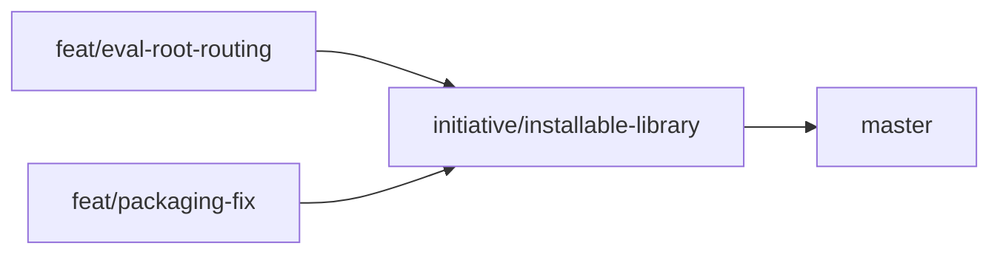

# Approach: Installable Library

## Strategy

Two parallel, non-blocking partitions. No shared state; neither depends on the other. Both are small, focused changes to the CLI and packaging layers with zero core/storage changes. Execute both simultaneously on separate feature branches, merge both into the initiative branch, then merge initiative to master.

## Partitions (Feature Branches)

### Partition 1: Init + Eval Root Routing → `feat/eval-root-routing`

**Modules**: `cli/main.py`, `cli/common.py`, `cli/commands/oneshot.py`, `cli/commands/conv.py`, `cli/commands/autotune.py`

**Scope**: `gavel init` command; `read_project_config()` + `resolve_eval_root()` helpers; uninit warning in main callback; `--eval-root` / `GAVEL_EVAL_ROOT` on all eval-touching commands; update `_get_eval_dir()` and `LocalFileSystemEvalContext` constructors.

**Dependencies**: None (parallel)

#### Artifact Type
cli

#### How to Run
_(no persistent process — invoke directly)_

- test: `uv run pytest tests/unit/cli/ -m unit`
- smoke: `gavel init --eval-root /tmp/gavel-test && gavel oneshot create --eval my-eval`
- warning check: run any `gavel` command in a directory with no `.gavel/config.json` — confirm warning line appears

#### Acceptance Criteria
- [ ] `gavel init` creates `.gavel/config.json` with `{"eval_root": "<chosen path>"}`
- [ ] `gavel init` run twice warns "Already initialized" and exits 0 without overwriting
- [ ] `gavel init --force` overwrites the existing config
- [ ] Any command run without `.gavel/config.json` prints a one-line warning to stderr; does NOT exit non-zero
- [ ] `gavel init` itself does NOT print the uninit warning
- [ ] `gavel oneshot run --help` shows `--eval-root` option with `[env var: GAVEL_EVAL_ROOT]` annotation
- [ ] Resolution chain: flag beats env var beats config.json beats default `.gavel/evaluations`
- [ ] `resolve_eval_root(None)` with no config.json returns `Path(".gavel/evaluations")`
- [ ] `resolve_eval_root(None)` with config.json `{"eval_root": "./evals"}` returns `Path("./evals")`
- [ ] `gavel conv --help` subcommands also show `--eval-root`
- [ ] All existing unit and integration tests pass

#### Implementation Steps
1. Add `read_project_config()` and `resolve_eval_root()` to `cli/common.py`; add unit tests
2. Add `gavel init` command to `cli/main.py`; add uninit warning to `@app.callback()`
3. In `oneshot.py`: update `_get_eval_dir()`; add `--eval-root` to `run`/`judge`/`report`/`list`; update `create`; remove `DEFAULT_EVAL_ROOT`
4. Apply same pattern to `conv.py` and `autotune.py`
5. Run `uv run pytest -m unit` and `uv run pytest -m integration`

---

### Partition 2: Packaging Fix → `feat/packaging-fix`

**Modules**: `pyproject.toml`

**Scope**: Add explicit `[tool.setuptools.packages.find]` and `[tool.setuptools.package-data]` declarations; verify `pip install -e .` works from a clean venv and includes templates.

**Dependencies**: None (parallel)

#### Artifact Type
library

#### How to Run
_(no persistent process)_

- verify: `pip install -e . && gavel --help`
- template check: `python -c "import importlib.resources; print(list(importlib.resources.files('gavel_ai.reporters').joinpath('templates').iterdir()))"`

#### Acceptance Criteria
- [ ] `pyproject.toml` has `[tool.setuptools.packages.find]` with `where = ["src"]`
- [ ] `pyproject.toml` has `[tool.setuptools.package-data]` with `gavel_ai = ["reporters/templates/*"]`
- [ ] After `pip install -e .` in a fresh venv, `gavel --help` exits 0
- [ ] After `pip install -e .`, `gavel oneshot report` does not raise `FileNotFoundError` for templates
- [ ] All existing unit and integration tests still pass after pyproject.toml changes

#### Implementation Steps
1. Add `[tool.setuptools.packages.find]` section to `pyproject.toml`
2. Add `[tool.setuptools.package-data]` section to `pyproject.toml`
3. Create a temp venv (`python -m venv /tmp/gavel-venv`), install (`/tmp/gavel-venv/bin/pip install -e .`), verify `gavel --help` works
4. Verify templates are accessible: run `gavel oneshot report` against an existing run or check template files via `importlib.resources`

---

## Sequencing

Both partitions are fully independent. Run in parallel.



### Partitions DAG

```yaml partitions
- name: feat/eval-root-routing
  modules: [cli/main.py, cli/common.py, cli/commands/oneshot.py, cli/commands/conv.py, cli/commands/autotune.py]
  depends_on: []

- name: feat/packaging-fix
  modules: [pyproject.toml]
  depends_on: []
```

## Migrations & Compat

No migration required. Default behavior (`--eval-root` absent, `GAVEL_EVAL_ROOT` unset) is identical to today. The `DEFAULT_EVAL_ROOT` constant in `oneshot.py` is removed but it was never part of the public API.

## Risks & Mitigations

| Risk | Mitigation |
|------|------------|
| `conv.py` or `autotune.py` have many more hardcoded eval-root references than expected | Read those files early in partition 1 before estimating effort; scope is bounded since `LocalFileSystemEvalContext` already accepts the root |
| setuptools auto-discovery already worked; pyproject.toml additions break something | Test `uv run pytest -m unit` after the pyproject change; additions are additive and shouldn't break existing behavior |
| Templates are already included via implicit auto-include | Adding explicit `package-data` is still correct — explicit > implicit for packaging |

## Alternatives Considered

**Global `--eval-root` on the top-level `gavel` callback**: Rejected in ADR-1 (tech-design.md) — requires Typer context threading through all sub-apps, significant boilerplate, and no user-facing advantage over per-command flags.

**`GAVEL_EVAL_ROOT` only (no CLI flag)**: Rejected — env-var-only config is hard to override for one-off invocations and doesn't follow existing CLI patterns (other options like `--eval` are CLI flags).
