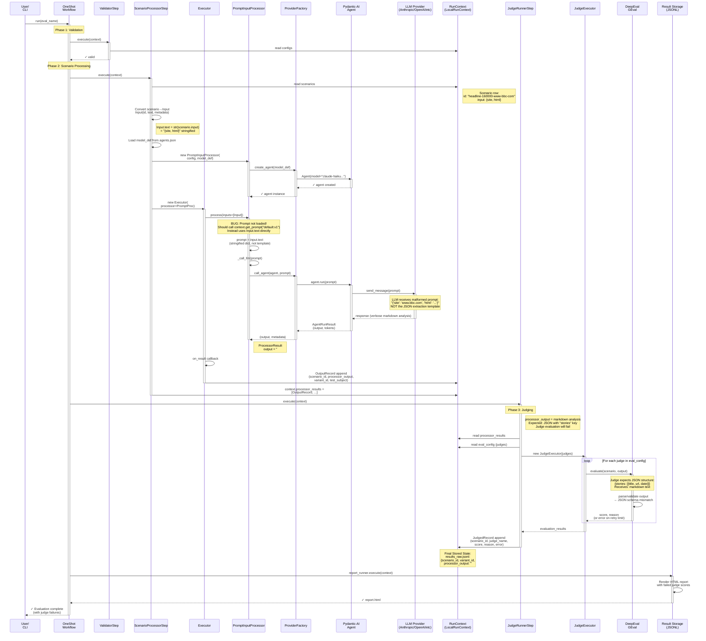

# OneShot Evaluation Flow: Single Scenario Processing & Judging

This document traces the execution path of a single scenario row through the gavel-ai one-shot workflow, from scenario input through processor execution to judge evaluation and storage.

## Sequence Diagram: Scenario → Output → Judged Result



---

## Data Flow: Transformations at Each Layer

### Layer 1: Input (Scenario → Input)

```
Scenario (from scenarios.json)
├── id: "headline-160000-www-bbc-com"
├── input: {
│     "site": "www.bbc.com",
│     "html": "<!DOCTYPE html>..."
│   }
└── metadata: {}

    ↓ ScenarioProcessorStep._convert_scenarios()

Input (for processor)
├── id: "headline-160000-www-bbc-com"
├── text: "{'site': 'www.bbc.com', 'html': '...'}"  ← BUG: Stringified input, not template
└── metadata: {}
```

### Layer 2: Processing (Input → ProcessorResult)

```
PromptInputProcessor.process([Input])
  │
  ├─ [BUG] Load prompt template
  │   Expected: context.get_prompt("default:v1")
  │   Actual:   (never called - prompt_processor.py is stub)
  │
  ├─ Render template
  │   Expected: template.format(input=Input.metadata)
  │   Actual:   (skipped)
  │
  └─ Call LLM
      Input to LLM: Input.text stringified dict
      Output: markdown analysis (not JSON)
      
      ↓

ProcessorResult
├── output: "# BBC Homepage Analysis\n\n## Overview\n..."
└── metadata: {
      "tokens": {"prompt": 0, "completion": 0},
      "latency_ms": 0
    }

    ↓ _make_output_record()

OutputRecord
├── test_subject: "default"
├── variant_id: "claude-haiku-4-5-20251001"
├── scenario_id: "headline-160000-www-bbc-com"
├── processor_output: "# BBC Homepage Analysis..."
├── tokens_prompt: 0
├── tokens_completion: 0
└── timestamp: "2026-04-11T15:12:41.243129+00:00"
```

### Layer 3: Judging (OutputRecord → JudgedRecord)

```
JudgeRunnerStep.execute(context)
  │
  ├─ Get processor results
  ├─ For each judge in eval_config
  │   │
  │   ├─ DeepEvalJudge.evaluate(scenario, output)
  │   │   │
  │   │   ├─ Schema: Expects JSON with "stories" key
  │   │   ├─ Actual output: Markdown analysis (no "stories")
  │   │   ├─ GEval criteria check fails
  │   │   └─ Score: null (or error)
  │   │
  │   └─ JudgeExecutor.execute() → evaluation_results
  │
  └─ Store results

JudgedRecord
├── scenario_id: "headline-160000-www-bbc-com"
├── variant_id: "claude-haiku-4-5-20251001"
├── judge_name: "schema_compliance"
├── score: null
├── reason: "Output does not contain expected JSON structure"
└── error: "JSON parsing failed" (or rate limit error)
```

---

## Class Hierarchy & Responsibilities

### Step Abstraction (Base Class: `core/steps/base.py::Step`)

```
Step (ABC)
├── phase: StepPhase enum
├── execute(context: RunContext) → None
└── safe_execute(context: RunContext) → None (error handling wrapper)

  ├── ValidatorStep
  │   └── Validates all config files before execution
  │
  ├── ScenarioProcessorStep
  │   ├── Converts scenarios → inputs
  │   ├── Instantiates processor (PromptInputProcessor or ClosedBoxInputProcessor)
  │   ├── Creates Executor
  │   └── Collects OutputRecords
  │
  ├── JudgeRunnerStep
  │   ├── Creates judge instances
  │   ├── Creates JudgeExecutor
  │   └── Collects JudgedRecords
  │
  └── ReportRunnerStep
      └── Renders reports from judged results
```

### Processor Abstraction (Base Class: `processors/base.py::InputProcessor`)

```
InputProcessor (ABC)
└── async process(inputs: List[Input]) → ProcessorResult

  ├── PromptInputProcessor [CURRENT - HAS BUG]
  │   ├── Uses Pydantic-AI Agent
  │   ├── Calls LLM with prompt
  │   └── Returns text output
  │       [MISSING: Prompt template loading & rendering]
  │
  ├── ClosedBoxInputProcessor
  │   ├── Calls external API
  │   └── Returns response
  │
  └── ScenarioProcessor [For conversational]
      └── Wraps inner processor for multi-turn
```

### Judge Abstraction (Base Class: `judges/base.py::Judge`)

```
Judge (ABC)
└── async evaluate(scenario, subject_output) → EvaluationResult

  ├── DeepEvalJudge
  │   ├── Wraps DeepEval metric
  │   ├── Criteria: schema validation, quality check
  │   └── Scores 1-10 or null on error
  │
  └── CustomGEvalJudge [Future]
      └── Custom evaluation logic
```

---

## Context Abstraction (Storage Layer)

```
RunContext (ABC)
├── eval_context: EvalContext
├── run_id: str
├── results_raw: RecordDataSource[OutputRecord]
├── results_judged: RecordDataSource[JudgedRecord]
└── run_logger: logging.Logger

  └── LocalRunContext [CONCRETE]
      ├── eval_context: LocalFileSystemEvalContext
      ├── .gavel/evaluations/{eval_name}/
      │   ├── config/
      │   │   ├── eval_config.json
      │   │   ├── agents.json
      │   │   ├── prompts/default.toml [NOT LOADED BY PROCESSOR]
      │   └── data/scenarios.json
      └── .gavel/evaluations/{eval_name}/runs/{run_id}/
          ├── .config/ (snapshot)
          ├── results_raw.jsonl [OutputRecord storage]
          ├── results_judged.jsonl [JudgedRecord storage]
          └── report.html
```

---

## The Bug: Missing Prompt Template Loading

### What Should Happen

```
ScenarioProcessorStep.execute(context)
  │
  ├─ test_subject = "default:v1"
  │
  └─ PromptInputProcessor(context, test_subject, model_def)
      
      PromptInputProcessor.process(inputs)
        │
        ├─ For each input:
        │   ├─ template = context.get_prompt(test_subject)
        │   │             → Loads .gavel/.../prompts/default.toml
        │   │             → Returns "You are a specialized news content analyzer..."
        │   │
        │   ├─ prompt = template.format(input=input.metadata)
        │   │           → Renders "{{ input.html }}" with actual HTML
        │   │
        │   └─ output = await self.agent.run(prompt)
        │              → LLM receives proper instructions + HTML
        │
        └─ OutputRecord with JSON output
```

### What Actually Happens

```
PromptInputProcessor.process(inputs)
  │
  ├─ For each input:
  │   ├─ prompt = input.text
  │   │           → Receives stringified dict: "{'site': '...', 'html': '...'}"
  │   │
  │   └─ output = await self.agent.run(prompt)
  │              → LLM sees malformed input, ignores template
  │              → Returns helpful markdown analysis instead
  │
  └─ OutputRecord with markdown output (mismatch!)
```

### Root Cause

1. **PromptInputProcessor is a stub** (`prompt_processor.py:119`)
   - Comment says: "Real implementation will load template and render with variables"
   - Currently just uses raw input text

2. **Prompt template never passed to processor**
   - `ScenarioProcessorStep` knows `test_subject = "default:v1"`
   - But doesn't pass it to `PromptInputProcessor`

3. **Processor has no access to context**
   - Can't call `context.get_prompt()`
   - No way to load TOML template files

---

## Summary

| Stage | Component | Data | Status |
|-------|-----------|------|--------|
| Input | ScenarioProcessorStep | Scenario → Input | ✓ Works |
| Process | PromptInputProcessor | Input → OutputRecord | ❌ BUG: No template loading |
| Judge | JudgeRunnerStep | OutputRecord → JudgedRecord | ✓ Works (but fails on bad output) |
| Store | RunContext | OutputRecord, JudgedRecord → JSONL | ✓ Works |
| Report | ReportRunnerStep | Results → HTML | ✓ Works |

**Fix Required**: Implement prompt template loading in `PromptInputProcessor` (see root cause section in debug output).
